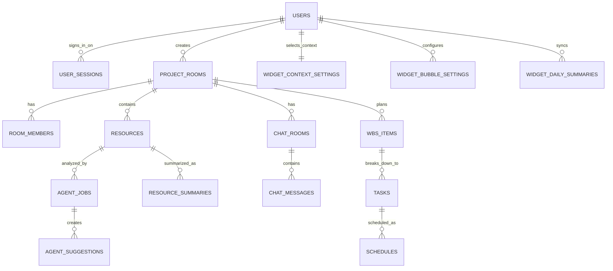

# Data Model

## 13. 데이터 설계

### 13.1 DB 문서 읽는 법

전체 ERD를 한 장으로 보면 너무 작게 보인다. 그래서 위키에서는 DB를 아래처럼 나눠서 본다.

|문서|용도|
|---|---|
|[09A_DB-Readable-ERD](./09A_DB-Readable-ERD)|도메인별로 쪼갠 읽을 수 있는 ERD|
|[09B_DB-Server-Tables](./09B_DB-Server-Tables)|서버 DB 테이블 묶음과 책임|
|[09C_DB-Tauri-SQLite](./09C_DB-Tauri-SQLite)|Tauri SQLite 로컬 테이블과 저장 기준|
|[10_API-Design](./10_API-Design)|HTTP API, DTO, WebSocket payload|

이 페이지는 DB 전체 기준과 데이터 딕셔너리를 정리한다. 화면에서 바로 관계를 확인할 때는 [09A_DB-Readable-ERD](./09A_DB-Readable-ERD)를 먼저 본다.

전체 ERD 이미지 보기

### 13.1.1 핵심 관계 요약

### 13.2 주요 테이블

아래 목록은 13.5 데이터 딕셔너리의 HTML 회의반영본 기준 테이블만 남긴 것이다.

| 테이블 | 역할 |
| --- | --- |
| users | 회원 정보와 구글 로그인 식별자 |
| user_sessions | 사용자 로그인 세션과 refresh token 상태 |
| user_preferences | 사용자 화면 기본 설정 |
| user_notification_preferences | 사용자별 알림 On/Off 설정 |
| user_privacy_consents | 활동 감지와 로컬 폴더 접근 동의 상태 |
| friend_requests | Bubli ID 기반 친구 요청 |
| friendships | 수락된 친구 관계 |
| project_rooms | 프로젝트와 프로젝트룸을 합친 업무 공간 |
| room_members | 프로젝트룸 참여자, 역할, 상태 |
| invitations | 기존 회원을 프로젝트룸에 초대하는 기록 |
| project_room_events | 프로젝트룸 실시간 이벤트와 누락 보충 sequence |
| resources | 개인 자료와 프로젝트룸 자료 카드 |
| resource_files | 저장소 파일 메타데이터 |
| resource_versions | 자료 파일 버전 기록 |
| resource_summaries | 에이전트가 생성한 자료 요약 결과 |
| resource_embeddings | 자료 검색과 관련 문서 추천용 chunk 벡터 |
| resource_comments | 자료 상세 댓글 |
| resource_relations | 관련 자료 후보 |
| ai_documents | 에이전트가 생성한 AI 문서 |
| agent_jobs | 에이전트 작업 요청과 실행 상태 |
| agent_job_events | 에이전트 작업 상태 전이 이벤트 |
| agent_model_call_logs | 모델 호출 기록과 비용/품질 추적 |
| agent_suggestions | WBS, TODO, 요구사항, 계약 확인, 일정, 문서 초안 후보 관리 |
| room_memory_summaries | 프로젝트룸 채팅과 작업 맥락 장기요약 |
| daily_summaries | 사용자가 확인한 개인 하루정리 요약 |
| wbs_items | 프로젝트룸 WBS 트리 항목 |
| tasks | 개인 TODO와 프로젝트룸 TODO |
| schedules | 일정과 WBS/TODO 연결 |
| memos | 개인 또는 프로젝트룸 메모 |
| time_logs | 타이머와 작업 시간 기록 |
| activity_logs | 사용자 동의 기반 앱/창 작업 맥락 기록 |
| chat_rooms | 프로젝트룸 채팅과 1:1 채팅방 |
| chat_room_members | 채팅방 참여자와 읽음 상태 |
| chat_messages | 저장되는 채팅 메시지 |
| notifications | 알림과 알림 버블 표시 데이터 |
| voice_rooms | LiveKit 방과 프로젝트룸/채팅방 연결 |
| voice_participants | 보이스챗 참가 기록 |
| storage_usage | 개인/프로젝트룸 자료 저장소 용량 |
| widget_context_settings | 위젯 전체의 현재 프로젝트룸 컨텍스트 |
| widget_bubble_settings | 버블별 켜짐, 위치, 크기, 표시 옵션 |
| widget_item_states | 버블 항목 확인, 숨김, 고정, 다시 보기 상태 |
| widget_daily_summaries | 서버에 반영된 날짜별 위젯 사용 집계 |
| managed_folders | 사용자가 선택한 개인 관리 폴더 |
| local_files | Tauri SQLite 로컬 파일 색인 |
| local_file_events | 로컬 파일 변경 이벤트 |
| sync_operation_logs | 로컬 동기화 작업 로그 |
| local_room_message_cache | 프로젝트룸 최근 채팅 캐시 |
| local_room_cache_state | 채팅 캐시 동기화 상태 |
| local_agent_messages | 서버에 올리지 않는 개인 에이전트 원문 |
| local_agent_summaries | 개인 에이전트 로컬 요약 |
| local_widget_display_cache | 최근 위젯 표시 데이터 캐시 |
| local_widget_usage_events | 서버에 올리지 않는 위젯 상세 사용 이벤트 |
| local_widget_usage_rollups | 날짜별, 버블별 로컬 위젯 집계 |
| local_timer_state | 실행 중 타이머 복구 상태 |
| local_sync_outbox | 서버 반영 대기열 |
| local_backup_manifest | Tauri SQLite 백업 manifest |

프로젝트와 프로젝트룸 정보는 `project_rooms`에서 관리하고, 참여와 권한은 `room_members`에서 관리한다. 자료 요약은 `resource_summaries`, 후보 생성 결과는 `agent_suggestions`에서 관리한다.

위젯 설정은 전체 컨텍스트와 버블별 설정으로 나누어 `widget_context_settings`, `widget_bubble_settings`에서 관리한다.

resources.visibility는 PERSONAL, ROOM_SHARED로 둔다. 개인 자료는 owner_id 기준이고, 프로젝트룸 자료는 room_id와 프로젝트룸 멤버 권한을 기준으로 접근한다.

local_files와 local_file_events는 Tauri 앱의 SQLite에 저장되는 클라이언트 데이터다. 서버 DB에는 사용자가 개인 자료함 동기화를 켠 관리 폴더 변경분이나 직접 업로드한 파일만 resources와 resource_versions로 반영한다.

managed_folders, local_files, local_file_events, sync_operation_logs는 사용자 소속이다. 프로젝트에 직접 귀속하지 않는다. 프로젝트룸 자료는 개인 자료를 옮겨 공유하지 않고, 사용자가 해당 프로젝트룸 자료 업로드 흐름에서 직접 올린 파일만 room_id를 가진다.

tasks는 개인 TODO와 프로젝트룸 TODO를 함께 다룬다. 개인 TODO는 owner_user_id만으로 사용자에게 귀속될 수 있고, 프로젝트룸 TODO는 room_id를 가진다. 프로젝트룸 TODO에 assignee_user_id가 있으면 해당 사용자의 대시보드와 TODO 버블에 함께 표시한다.

계약 관련 참고값은 별도 계약 후보 테이블을 만들지 않고 project_rooms의 선택 입력 필드와 agent_suggestions의 확인 후보로 관리한다.

|필드|설명|
|---|---|
|contract_amount|계약 금액 (선택 입력, project_rooms)|
|payment_status|입금 상태. NOT_RECORDED, PENDING, PAID, OVERDUE. 기본값 NOT_RECORDED 추천|
|payment_due_date|입금 예정일 (선택 입력)|
|paid_at|실제 입금일 (선택 입력)|

부가세 포함 여부처럼 계약서에 적힌 금액 관련 조건은 확인 항목으로 표시할 수 있다. 다만 세금 계산, 비용 계산, 순이익 계산, 분할 정산, 여러 차수 정산 계산은 회계·정산 기능이므로 향후 확장으로 둔다.

### 13.3 상태값 기준

상태값은 화면 문구, API 응답, DB 저장이 같은 기준을 써야 한다. 같은 의미를 화면마다 다른 말로 부르지 않는다.

| 대상         | 상태값                                                                                  | 의미                          |
| ---------- | ------------------------------------------------------------------------------------ | --------------------------- |
| 계정 | ACTIVE, SUSPENDED, WITHDRAWN | 활성, 정지, 탈퇴 |
| 인증 세션 | ACTIVE, REVOKED, EXPIRED | 사용 중, 로그아웃 또는 무효화, 만료 |
| 친구 요청 | PENDING, ACCEPTED, REJECTED, CANCELED | 요청 대기, 수락, 거절, 취소 |
| 프로젝트룸 | ACTIVE, CLOSED | 진행 중, 종료 |
| 입금 | NOT_RECORDED, PENDING, PAID, OVERDUE | 미기록, 입금 대기, 입금 완료, 입금 지연 |
| 프로젝트룸 멤버 | ACTIVE, LEFT, REMOVED | 참여 중, 직접 나감, 프로젝트 리더가 내보냄 |
| 초대 | PENDING, ACCEPTED, EXPIRED, CANCELED | 초대 대기, 수락, 만료, 취소 |
| 자료 | UPLOADING, READY, ANALYZING, ANALYZED, FAILED | 업로드, 준비 완료, 분석 중, 분석 완료, 실패 |
| 자료 요약 | READY, ANALYZING, ANALYZED, FAILED | 요약 준비, 분석 중, 분석 완료, 실패 |
| 에이전트 작업 | PENDING, RUNNING, SUCCEEDED, FAILED, CANCELED | 대기, 실행 중, 성공, 실패, 취소 |
| 에이전트 제안 | DRAFT, APPROVED, HELD, REJECTED | 승인 전, 승인, 보류, 거절 |
| 프로젝트룸 장기요약 | DRAFT, APPROVED | 승인 전, 승인 |
| 하루정리 요약 | DRAFT, APPROVED | 승인 전, 승인 |
| WBS | TODO, IN_PROGRESS, DONE | 대기, 진행 중, 완료 |
| TODO/작업 | TODO, IN_PROGRESS, REVIEW, DONE, BLOCKED | 대기, 진행 중, 검토, 완료, 막힘 |
| 일정 동기화 | LOCAL_ONLY, SYNCED, SYNC_FAILED | 로컬 일정, 동기화 완료, 동기화 실패 |
| 메모 | ACTIVE, DELETED | 활성, 삭제 처리 |
| 타이머 | RUNNING, PAUSED, ENDED, NEEDS_RECOVERY | 실행 중, 일시정지, 종료, 복구 필요 |
| 채팅방 | ACTIVE, CLOSED | 활성, 닫힘 |
| 채팅방 멤버 | ACTIVE, LEFT | 참여 중, 나감 |
| 알림 | UNREAD, READ | 읽지 않음, 읽음 |
| 보이스 방 | OPEN, ENDED | 열림, 종료 |
| 보이스 참가 | JOINED, LEFT, DISCONNECTED | 참여, 퇴장, 연결 끊김 |
| 관리 폴더 | ACTIVE, PAUSED, REMOVED | 사용 중, 일시중지, 제거 |
| 로컬 파일 | LOCAL_ONLY, SYNC_PENDING, SYNCED, CONFLICT | 로컬 전용, 동기화 대기, 동기화 완료, 충돌 |
| 동기화 작업 로그 | PENDING, SUCCEEDED, FAILED | 대기, 성공, 실패 |
| 로컬 채팅 캐시 | VALID, STALE, REBUILDING | 정상, 오래됨, 재구성 중 |
| 위젯 항목 상태 | VISIBLE, CONFIRMED, HIDDEN, PINNED, SNOOZED | 표시, 확인, 숨김, 고정, 나중에 보기 |
| 위젯 사용 집계 | LOCAL_ONLY, SYNC_PENDING, SYNCED, FAILED | 로컬 집계, 서버 반영 대기, 반영 완료, 실패 |
| 로컬 타이머 | RUNNING, PAUSED, NEEDS_RECOVERY | 실행 중, 일시정지, 복구 필요 |
| 로컬 동기화 대기열 | PENDING, SENDING, SENT, FAILED | 서버 반영 전 대기, 전송 중, 완료, 실패 |

### 13.4 기능별 데이터 흐름 매트릭스

아래 표는 기능이 화면에서 끝나지 않고 DB와 버블까지 이어지는지 확인하기 위한 기준이다.

|기능|화면|사용자 행동|API 또는 Tauri IPC|저장 위치|상태와 표시|
|---|---|---|---|---|---|
|프로젝트룸 생성|프로젝트룸 생성|프로젝트룸 정보와 계약/입금 참고값 입력|POST /api/project-rooms|project_rooms, room_members|프로젝트룸은 ACTIVE로 생성, 생성자는 room_members에 ACTIVE로 추가|
|친구 추가|소통|Bubli ID 검색, 친구 요청, 수락 또는 거절|GET /api/friends/search, POST /api/friend-requests, PATCH /api/friend-requests/{id}/accept|friend_requests, friendships, notifications|ACCEPTED 친구만 1:1 채팅과 프로젝트룸 초대 대상에 표시|
|프로젝트룸 초대|프로젝트룸 멤버 관리|프로젝트 리더가 친구를 선택해 초대하고, 사용자가 수락|POST /api/project-rooms/{roomId}/invitations, PATCH /api/invitations/{id}/accept|invitations, room_members, notifications|PENDING 초대가 ACCEPTED가 되면 ACTIVE room_member 생성|
|멤버 권한 관리|프로젝트룸 멤버 관리|역할 변경, 나가기, 내보내기|PATCH /api/project-rooms/{roomId}/members/{userId}, DELETE /api/project-rooms/{roomId}/members/{userId}|room_members, notifications|프로젝트 리더/멤버 역할과 ACTIVE/LEFT/REMOVED 상태 관리|
|사용자별 설정|설정|프로필, 테마, 알림, 활동 감지 동의 변경|GET/PATCH /api/me/preferences, GET/PATCH /api/me/notification-preferences, PATCH /api/me/privacy-consents|users, user_preferences, user_notification_preferences, user_privacy_consents|설정은 userId 기준으로 저장되고 다른 멤버에게 영향 없음|
|개인 관리 폴더|Tauri 설정, 개인 자료보드|폴더 선택, scan, 변경 감지, 개인 자료함 자동 동기화|Tauri IPC select_folder, scan_folder, watch_folder, sync_local_file_changes / POST /api/local-file-events/sync|Tauri SQLite local_files, local_file_events / 서버 resources, resource_versions|동기화가 켜진 관리 폴더 변경분은 서버 개인 자료함에 자동 반영. 프로젝트룸 자료로 자동 공유하지 않음|
|자료 분석|자료 상세|분석 요청 또는 업로드 후 자동 분석|POST /api/ai/analyze-resource, GET /api/agent-jobs/{jobId}|agent_jobs, agent_job_events, agent_model_call_logs, resource_summaries, resource_embeddings, agent_suggestions|job은 PENDING/RUNNING/SUCCEEDED/FAILED. 요약은 READY/ANALYZING/ANALYZED/FAILED로 관리|
|후보 승인|에이전트 제안, WBS/작업판|후보 승인, 수정, 보류, 거절|PATCH /api/agent/suggestions/{id}|agent_suggestions, wbs_items, tasks, schedules|APPROVED만 실제 업무 데이터로 반영|
|WBS/작업판|프로젝트룸 WBS/작업판|작업 추가, 순서 변경, 담당자 지정|POST/PATCH /api/project-rooms/{roomId}/wbs-items, POST/PATCH /api/tasks/{id}|wbs_items, tasks, schedules|작업 상태가 대시보드, TODO 버블, 일정/WBS 버블에 표시|
|채팅과 알림|소통|메시지 전송, 댓글, 새 버전 확인|POST /api/chat/rooms/{id}/messages, WebSocket /topic/chat/{id}|chat_messages, notifications|서버에 저장된 chat_messages row를 확정 메시지로 본다. UNREAD 알림은 웹과 알림 버블에 표시|
|프로젝트룸 채팅 캐시|Tauri 소통|채팅방 진입, 새 메시지 수신, 캐시 재동기화|GET /api/chat/rooms/{id}/messages?afterSequence, Tauri IPC sync_room_messages|서버 chat_messages / Tauri SQLite local_room_message_cache, local_room_cache_state|서버 DB가 원본. 캐시 손상 시 최근 100개 메시지 재생성|
|프로젝트룸 장기기억|프로젝트룸 채팅|/bubli 정리, /bubli todo, /bubli 질문|POST /api/project-rooms/{roomId}/agent-command, POST /api/project-rooms/{roomId}/memory-summaries|chat_messages, room_memory_summaries|에이전트 응답은 AGENT_RESPONSE, 장기요약은 메시지 범위와 함께 저장|
|개인 SQLite 백업|Tauri 설정|앱 종료, 하루정리 완료, 수동 백업, 마이그레이션 전 백업|Tauri IPC backup_local_sqlite, restore_local_sqlite_backup, check_local_sqlite_integrity|Tauri SQLite local_backup_manifest, 백업 파일|백업은 로컬 기기에 저장. 손상 시 최신 정상 백업으로 복구|
|프로젝트룸 보이스|소통|보이스 시작, 참여, 나가기|POST /api/voice/rooms, POST /api/voice/rooms/{id}/token|voice_rooms, voice_participants|참여자 상태는 소통 화면과 소통 버블에 표시|
|버블 설정|Tauri 위젯 설정|프로젝트룸 컨텍스트 선택, 버블 켜기/끄기, 위치 변경|GET/PATCH /api/widget/settings|widget_context_settings, widget_bubble_settings|GET /api/widget/summary가 현재 컨텍스트와 버블별 표시 데이터를 반환|
|버블 항목 상태|Tauri 위젯|버블 항목 확인, 숨김, 고정, 다시 보기|PATCH /api/widget/items/{id}/state|widget_item_states|같은 사용자가 다시 열어도 항목 상태 유지|
|버블 사용 집계|Tauri 위젯|열기, 닫기, 클릭, 머문 시간 집계|Tauri IPC record_widget_usage_event, rollup_widget_usage, sync_widget_usage_summary / POST /api/widget/usage-summaries|Tauri SQLite local_widget_usage_events, local_widget_usage_rollups / 서버 widget_daily_summaries|상세 이벤트는 로컬, 날짜별/기기별 집계만 서버 저장|
|타이머 기록|타이머 버블|시작, 일시정지, 재개, 종료, heartbeat|POST /api/time-logs/start, PATCH /api/time-logs/{id}/pause, resume, stop, heartbeat|서버 time_logs / Tauri SQLite local_timer_state, local_sync_outbox|서버 time_logs가 원본. 비정상 종료 시 마지막 heartbeat 기준 복구|
|내부 일정|일정/WBS 버블, WBS/작업판|마감일, 일정 등록, WBS 연결|POST/PATCH /api/schedules/{id}|schedules, tasks, wbs_items|가까운 일정은 대시보드와 일정/WBS 버블에 표시|

### 13.5 데이터 딕셔너리

데이터 딕셔너리는 개발자가 같은 데이터를 같은 뜻으로 쓰기 위한 기준이다. 아래 필드명과 상태값을 ERD, API, 화면 문구의 기준으로 둔다.

공통 필드는 아래처럼 둔다.

| 필드         | 타입 예시              | 의미             | 기준                     |
| ---------- | ------------------ | -------------- | ---------------------- |
| id         | UUID 또는 BIGINT     | 각 데이터의 고유 ID   | 팀 DB 전략에 맞춰 하나로 통일     |
| created_at | timestamp          | 생성 시각          | 서버 기준 시각               |
| updated_at | timestamp          | 마지막 수정 시각      | 수정 API 성공 시 갱신         |
| deleted_at | timestamp nullable | 삭제 처리 시각 | 물리 삭제 전 soft delete 후보 |

API와 DB는 아래처럼 나눠서 본다.

|구분|문서 위치|다루는 내용|
|---|---|---|
|API 계약|[API Design](./10_API-Design)|HTTP 경로, request DTO, response DTO, WebSocket payload, 에러 코드|
|DB 계약|이 문서|테이블, 컬럼, 인덱스, token hash 저장, sequence 저장, 상태값|
|Tauri 로컬 저장|이 문서|SQLite 테이블, 로컬 캐시, 로컬 대기열, 백업 manifest|

API 계약에서 쓰는 `camelCase` 필드는 DB에서는 `snake_case` 컬럼으로 저장한다. 예를 들어 `clientMessageId`는 `chat_messages.client_message_id`, `roomSequence`는 `chat_messages.room_sequence`, `lastReadSequence`는 `chat_room_members.last_read_sequence`로 저장한다.

물리 컬럼은 JPA가 자동으로 만들어주더라도 아래 기준을 먼저 정한다. 문자열 길이, NULL 허용 여부, 기본값, 인덱스는 DB 성능과 데이터 무결성에 영향을 주기 때문에 엔티티 애노테이션과 마이그레이션 SQL에서 같은 기준으로 맞춘다.

| 기준  | 원칙                                                                                     |
| --- | -------------------------------------------------------------------------------------- |
| ID  | 서버 DB는 UUID를 기본으로 둔다. Tauri SQLite는 TEXT UUID를 기본으로 둔다.                                  |
| 시간  | 서버 DB는 timestamptz, Tauri SQLite는 ISO-8601 TEXT 또는 INTEGER epoch 중 하나로 통일한다.                 |
| 금액  | 정수 원 단위면 BIGINT, 소수 통화가 필요하면 DECIMAL(15,2)를 쓴다.                                       |
| 본문  | 채팅, 요약, JSON 결과는 TEXT 또는 JSONB를 쓴다. 길이 제한이 필요한 입력값은 애플리케이션에서 먼저 검증한다.                |
| 상태값 | DB에는 VARCHAR(30) 또는 enum을 쓰고, 코드에서는 enum 상수로 관리한다.                                     |
| NULL | 필수 외래키와 상태값은 NOT NULL로 둔다. 선택 입력값과 조건부 식별자는 NULL을 허용하되 CHECK 제약을 둔다. |
| 인덱스 | 권한 조회, 목록 조회, 동기화 기준 컬럼에는 인덱스를 둔다. 예: user_id, room_id, chat_room_id, room_sequence.     |

#### HTML 기준 데이터 딕셔너리

아래 내용은 `Final_docs/Bubli_DB_검토보드 2/09_데이터딕셔너리_회의반영_2026-06-24.html`의 3번 카테고리 이후를 기준으로 반영한 것이다. 공통 컬럼 설명은 위 항목을 유지한다.

#### 3. 사용자, 인증, 설정

##### 3.1 users

회원 자체를 저장하는 테이블이다.

로그인, 친구 검색, 작성자 표시, 권한 확인의 시작점이다.

| 컬럼 | 키 | 뜻 | 왜 필요한가 | 이번 구현 |
| --- | --- | --- | --- | --- |
| `id` | PK | 회원 ID | 모든 사용자 데이터의 기준 | 필수 |
| `google_sub` | UK | 구글 계정 고유 ID | 구글 로그인 계정 식별 | 필수, UNIQUE. 이메일/비밀번호 로그인은 사용하지 않음 |
| `bubli_id` | UK | 친구 검색용 ID | 이메일을 공개하지 않고 친구 검색, 가입 시 서버에서 자동 생성 | 친구 기능을 하면 필요, UNIQUE |
| `name` | - | 표시 이름 | 화면, 채팅, 멤버 목록에 표시 | 필수 |
| `avatar_url` | - | 프로필 이미지 주소 | 프로필 메뉴, 댓글, 멤버 목록 표시 | 선택 |
| `locale` | - | 언어/지역 표시 설정 | 한국어, 영어, 일본어 표시와 날짜 형식 | 다국어를 보여줄 거면 유지 |
| `timezone` | - | 사용자 시간대 | 일정, 마감, 하루정리 기준 시간 | 일정 기능 때문에 유지 추천 |
| `status` | - | 계정 상태 | 탈퇴, 정지, 활성 계정 구분 | 필수 |
| `created_at` | - | 회원 생성 시각 | 가입일, 회원 관리 기준 | 필수 |
| `updated_at` | - | 수정 시각 | row 수정 시각 추적 | 필수 |
| `deleted_at` | - | 삭제 처리 시각 | 물리 삭제 대신 삭제 상태 표시 | soft delete 필요 시 사용 |

`locale`은 위치 정보가 아니다.

`ko-KR`, `en-US`, `ja-JP`처럼 화면 언어와 날짜/숫자 표시 형식을 정하는 값이다.

로그인은 구글 로그인만 사용한다.

따라서 로컬 로그인용 `email`, `password` 컬럼은 두지 않고, 구글 OAuth의 고유 식별자인 `google_sub`로 사용자를 식별한다.

##### 3.2 user_sessions

사용자의 로그인 세션과 refresh token 상태를 관리하는 테이블이다.

다중 기기 관리를 위한 테이블은 아니지만, 웹과 Tauri 앱은 동시에 사용할 수 있도록 `client_type`별 세션을 분리한다.

| 컬럼 | 키 | 뜻 | 왜 필요한가 | 이번 구현 |
| --- | --- | --- | --- | --- |
| `id` | PK | 세션 ID | access token 안에 넣을 세션 기준 | 필수 |
| `user_id` | UK FK | 로그인한 사용자 | 어떤 사용자의 세션인지 확인 | 필수, `client_type`과 복합 UNIQUE |
| `refresh_token` | UK | refresh token | 원문 저장 없이 재발급 검증 | 필수, UNIQUE |
| `client_type` | UK | 로그인 클라이언트 종류 | `WEB`, `TAURI` 세션 분리 | 필수, `user_id`와 복합 UNIQUE |
| `status` | - | 세션 상태 | `ACTIVE`, `REVOKED`, `EXPIRED` 구분 | 필수 |
| `expires_at` | - | refresh token 만료 시각 | 자동 만료 처리 | 필수 |
| `last_used_at` | - | 마지막 사용 시각 | refresh 재발급 시 갱신 | 선택 |
| `revoked_at` | - | 로그아웃/무효화 시각 | 로그아웃 처리 기준 | 필수 추천 |
| `created_at` | - | 생성 시각 | 로그인 시각 기록 | 필수 |
| `updated_at` | - | 수정 시각 | 세션 상태 변경 기록 | 필수 |

`user_id`와 `client_type`은 복합 UNIQUE로 둔다.

따라서 한 사용자는 `WEB` 세션 row 1개와 `TAURI` 세션 row 1개를 가질 수 있다.

같은 `client_type`에서 다시 로그인하면 새 row를 만들지 않고 기존 row의 `refresh_token`, `status`, `expires_at`, `updated_at`을 갱신한다.

##### 3.3 user_preferences

사용자가 Bubli 화면을 어떻게 보고 싶은지 저장하는 개인 설정 테이블이다.

현재 기획에서는 과한 값이 섞여 있다.

| 컬럼 | 키 | 뜻 | 왜 필요한가 | 이번 구현 |
| --- | --- | --- | --- | --- |
| `id` | PK | 설정 row ID | 설정 row 식별 | 없어도 됨. `user_id` PK도 가능 |
| `user_id` | UK FK | 설정 주인 | 본인 설정만 조회/수정 | 설정 테이블을 만들면 필수 |
| `theme` | - | 화면 테마 | 라이트/다크 등 테마 선택 | 현재 디자인 고정이면 보류 |
| `font_scale` | - | 글자 크기 배율 | 접근성 설정 | 이번에는 보류 |
| `default_room_id` | FK | 기본으로 열 프로젝트룸 | 앱 시작 시 특정 프로젝트룸을 열기 | 이름 변경 추천 |
| `created_at` | - | 생성 시각 | row 생성 시각 추적 | 필수 |
| `updated_at` | - | 수정 시각 | row 수정 시각 추적 | 필수 |

추천은 이번 구현에서 `user_preferences`를 크게 만들지 않는 것이다.

언어와 시간대는 `users.locale`, `users.timezone`에 두고, 위젯 설정은 `widget_*`에서 따로 관리한다.

기본 화면이 꼭 필요하면 아래처럼 이름을 명확히 한다.

| 추천 컬럼 | 키 | 뜻 |
| --- | --- | --- |
| `default_home_type` | - | 앱 첫 화면이 개인 대시보드인지 프로젝트룸인지 |
| `default_project_room_id` | FK | 기본 프로젝트룸일 때 열 프로젝트룸 ID |

##### 3.4 user_notification_preferences

위젯/앱에서 보여줄 알림 종류별 사용자 On/Off 설정이다.

| 컬럼 | 키 | 뜻 | 왜 필요한가 | 이번 구현 |
| --- | --- | --- | --- | --- |
| `user_id` | PK FK | 설정 주인 | 본인 설정만 변경 | 필수, notification_type과 복합 PK |
| `notification_type` | PK | 알림 종류 | 메시지, 댓글, 에이전트 완료 등 구분 | 필수, user_id와 복합 PK |
| `enabled` | - | 받을지 여부 | 알림 끄기/켜기 | 필수 |

앱 안에서 받는 알림만 전제하므로 `channel`은 두지 않는다.

단순 On/Off 설정이므로 `created_at`, `updated_at`은 두지 않는다.

실제 알림 데이터는 `notifications` 테이블에서 관리한다.

##### 3.5 user_privacy_consents

활동 감지, 로컬 폴더 접근 같은 민감한 기능의 사용자 동의 상태다.

| 컬럼 | 키 | 뜻 | 왜 필요한가 | 이번 구현 |
| --- | --- | --- | --- | --- |
| `user_id` | PK FK | 동의한 사용자 | 본인 동의만 변경 | 필수, consent_type과 복합 PK |
| `consent_type` | PK | 동의 종류 | `ACTIVITY_CONTEXT`, `MANAGED_FOLDER` 등 | 필수, user_id와 복합 PK |
| `enabled` | - | 동의 여부 | 켰는지 껐는지 저장 | 필수 |
| `updated_at` | - | 마지막 변경 시각 | 마지막으로 동의를 켜거나 끈 시각 | 필수 |

활동 감지는 화면 전체나 키보드 입력이 아니다.

사용자 동의 후 앱 이름, 창 제목, 머문 시간 정도만 다룬다.

동의 row를 다른 테이블이 직접 참조하지 않으므로 별도 `id` 없이 `user_id`와 `consent_type` 복합 PK로 관리한다.

별도 변경 로그는 두지 않고, 동의 상태가 바뀔 때 기존 row의 `enabled`와 `updated_at`을 갱신한다.

#### 4. 친구와 초대

##### 4.1 friend_requests

Bubli ID로 친구 요청을 보낼 때 쓴다.

| 컬럼 | 키 | 뜻 | 왜 필요한가 | 이번 구현 |
| --- | --- | --- | --- | --- |
| `id` | PK | 친구 요청 ID | 요청 하나를 식별 | 친구 기능 있으면 필수 |
| `requester_id` | UK FK | 요청한 사용자 | 누가 보냈는지 | 필수 |
| `receiver_id` | UK FK | 받은 사용자 | 누가 받았는지 | 필수 |
| `status` | - | 요청 상태 | `PENDING`, `ACCEPTED`, `REJECTED`, `CANCELED` | 필수 |
| `responded_at` | - | 응답 시각 | 수락/거절 시각 | 선택 |
| `created_at` | - | 생성 시각 | row 생성 시각 추적 | 필수 |

##### 4.2 friendships

수락된 친구 관계를 저장한다.

프로젝트룸 초대 대상을 고를 때 쓴다.

| 컬럼 | 키 | 뜻 | 왜 필요한가 | 이번 구현 |
| --- | --- | --- | --- | --- |
| `id` | PK | 친구 관계 ID | row 식별 | 친구 기능 있으면 필수 |
| `user_id` | UK FK | 기준 사용자 | 내 친구 목록 조회 | 필수 |
| `friend_user_id` | UK FK | 친구 사용자 | 상대방 | 필수 |
| `accepted_at` | - | 친구가 된 시각 | 정렬, 기록 | 선택 |
| `created_at` | - | 생성 시각 | row 생성 시각 추적 | 필수 |

한 row로 양방향을 처리할지, 양방향 row 2개로 저장할지는 팀 결정이 필요하다.

구현 난이도는 양방향 row 2개가 더 쉽다.

차단 기능은 제외하고, 친구 삭제는 `deleted_at` 없이 관계 row를 물리 삭제하는 방식으로 처리한다.

#### 5. 프로젝트와 프로젝트룸

프로젝트 하나당 프로젝트룸 하나를 기준으로 보고, 프로젝트 정보와 계약/입금 정보는 `project_rooms`에서 함께 관리한다.

참여와 권한은 `room_members`에서 관리한다.

##### 5.1 project_rooms

프로젝트와 프로젝트룸을 합친 테이블이다.

계약 금액과 입금 정보도 여기서 같이 관리한다.

| 컬럼 | 키 | 뜻 | 왜 필요한가 | 이번 구현 |
| --- | --- | --- | --- | --- |
| `id` | PK | 프로젝트룸 ID | 프로젝트룸 식별 | 필수 |
| `created_by_user_id` | FK | 처음 만든 사용자 | 생성자 기록. 리더 권한과는 별개 | 필수 |
| `name` | - | 프로젝트룸 이름 | 목록, 헤더 표시 | 필수 |
| `client_name` | - | 클라이언트명 | 프로젝트 참고 정보 | 선택 |
| `contract_amount` | - | 계약 금액 | 입금 관리 기준 | 선택 |
| `payment_status` | - | 입금 상태 | `NOT_RECORDED`, `PENDING`, `PAID`, `OVERDUE` 구분 | 필수, 기본값 `NOT_RECORDED` 추천 |
| `payment_due_date` | - | 입금 예정일 | 입금 일정 관리 | 선택 |
| `paid_at` | - | 실제 입금일 | 입금 완료 기록 | 선택 |
| `status` | - | 룸 상태 | 진행 중/종료 상태 구분 | 필수, 기본값 `ACTIVE` |
| `closed_at` | - | 종료 시각 | 종료 처리 시점 기록 | 선택 |
| `created_at` | - | 생성 시각 | row 생성 시각 추적 | 필수 |
| `updated_at` | - | 수정 시각 | row 수정 시각 추적 | 필수 |

`estimate_amount`는 제거한다.

계약이 체결된 뒤 프로젝트가 시작되므로 견적 금액은 프로젝트룸 테이블에서 관리하지 않는다.

##### 5.2 room_members

프로젝트룸 참여자와 역할, 상태를 관리한다.

프로젝트룸 접근 권한의 기준 테이블이다.

| 컬럼 | 키 | 뜻 | 왜 필요한가 | 이번 구현 |
| --- | --- | --- | --- | --- |
| `id` | PK | 룸 멤버 ID | row 식별 | 필수 |
| `room_id` | UK FK | 프로젝트룸 | 어떤 룸의 멤버인지 | 필수, user_id와 복합 UNIQUE |
| `user_id` | UK FK | 참여 사용자 | 누가 참여 중인지 | 필수, room_id와 복합 UNIQUE |
| `role` | - | 룸 역할 | 리더, 멤버 권한 구분 | 필수, 기본값 `MEMBER` |
| `status` | - | 참여 상태 | 활성/나감/제거 상태 구분 | 필수, 기본값 `ACTIVE` |
| `created_at` | - | 생성 시각 | row 생성 시각 추적 | 필수 |
| `updated_at` | - | 수정 시각 | 참여 상태, 역할 변경 기록 | 필수 |

`UNIQUE(room_id, user_id)`로 중복 참여를 막는다.

재참여 시 새 row를 계속 만들지 않고 기존 row의 `status`, `role`, `updated_at`을 갱신한다.

##### 5.3 invitations

프로젝트룸 초대 기록이다.

기존 회원을 프로젝트룸에 초대하는 용도로 사용한다.

| 컬럼 | 키 | 뜻 | 왜 필요한가 | 이번 구현 |
| --- | --- | --- | --- | --- |
| `id` | PK | 초대 ID | 초대 식별 | 초대 기능 있으면 필수 |
| `room_id` | FK | 초대할 프로젝트룸 | 어느 룸에 초대하는지 | 필수 |
| `inviter_user_id` | FK | 초대한 사용자 | 권한 확인과 기록 | 필수 |
| `invitee_user_id` | FK | 초대받은 사용자 | 어떤 회원에게 초대했는지 기록 | 필수 |
| `role` | - | 수락 후 부여할 역할 | 초대 수락 시 room_members 역할 생성 | 필수, 기본값 `MEMBER` |
| `status` | - | 초대 상태 | `PENDING`, `ACCEPTED`, `EXPIRED`, `CANCELED` | 필수, 기본값 `PENDING` |
| `expires_at` | - | 만료 시각 | 초대 만료 처리 | 필수 추천 |
| `accepted_at` | - | 수락 시각 | 수락된 경우 기록 | 선택 |
| `created_at` | - | 생성 시각 | row 생성 시각 추적 | 필수 |
| `updated_at` | - | 수정 시각 | 초대 상태 변경 기록 | 필수 |

##### 5.4 project_room_events

프로젝트룸에서 여러 화면이 같이 갱신되어야 할 이벤트를 저장한다.

WebSocket이 끊겼을 때 빠진 이벤트를 `sequence`로 보충한다.

| 컬럼 | 키 | 뜻 | 왜 필요한가 | 이번 구현 |
| --- | --- | --- | --- | --- |
| `id` | PK | 이벤트 ID | 이벤트 식별 | 실시간 보충을 하려면 필요 |
| `room_id` | UK FK | 프로젝트룸 | 어느 룸 이벤트인지 | 필수, sequence와 복합 UNIQUE |
| `sequence` | UK | 룸 안의 이벤트 순서 | 끊긴 뒤 빠진 이벤트 보충 | 필수, room_id와 복합 UNIQUE |
| `event_type` | - | 이벤트 종류 | `RESOURCE_UPLOADED`, `TASK_UPDATED`, `SCHEDULE_CREATED` 등 | 필수 |
| `actor_user_id` | FK | 이벤트를 만든 회원 | 사용자가 만든 이벤트 추적 | 시스템/에이전트면 NULL 가능 |
| `payload_json` | - | 이벤트 내용 | 화면 갱신에 필요한 최소 정보 | 필수 |
| `occurred_at` | - | 발생 시각 | 이벤트 정렬과 기록 | 필수 |

초기 구현에서 WebSocket 보충까지 안 할 거면 보류 가능하다.

#### 6. 자료와 파일

##### 6.1 resources

자료 카드의 원본 테이블이다.

파일 원본 자체가 아니라, 자료의 제목, 소유자, 공개 범위, 상태를 저장한다.

| 컬럼 | 키 | 뜻 | 왜 필요한가 | 이번 구현 |
| --- | --- | --- | --- | --- |
| `id` | PK | 자료 ID | 자료 식별 | 필수 |
| `owner_id` | FK | 자료 소유자 | 개인 자료 권한 판단 | 필수 |
| `room_id` | FK | 연결 프로젝트룸 | 프로젝트룸 자료일 때 필요 | 조건부 필수 |
| `title` | - | 자료 제목 | 자료보드 표시 | 필수 |
| `kind` | - | 자료 종류 | `FILE`, `MEMO` 구분 | 링크는 제외 |
| `visibility` | - | 공개 범위 | `PERSONAL`, `ROOM_SHARED` | 필수 |
| `status` | - | 자료 상태 | 업로드, 준비 완료, 분석, 실패 등 | 필수 |
| `created_at` | - | 생성 시각 | row 생성 시각 추적 | 필수 |
| `updated_at` | - | 수정 시각 | row 수정 시각 추적 | 필수 |
| `deleted_at` | - | 삭제 처리 시각 | 물리 삭제 대신 삭제 상태 표시 | soft delete 필요 시 사용 |

개인 자료는 `owner_id` 기준이다.

프로젝트룸 자료는 `room_id`와 `room_members` 기준이다.

##### 6.2 resource_files

실제 파일 저장소의 메타데이터다.

파일 원본은 S3 또는 로컬 저장소에 있고, DB에는 경로와 정보만 저장한다.

| 컬럼 | 키 | 뜻 | 왜 필요한가 | 이번 구현 |
| --- | --- | --- | --- | --- |
| `id` | PK | 파일 ID | 파일 메타데이터 식별 | 필수 |
| `resource_id` | FK | 연결 자료 | 어떤 자료의 파일인지 | 필수 |
| `storage_key` | UK | 저장소 경로 key | S3에서 파일 찾기 | 필수, UNIQUE |
| `original_name` | - | 원래 파일명 | 사용자에게 보여줄 이름 | 필수 |
| `mime_type` | - | 파일 형식 | PDF, DOCX 등 처리 | 필수 |
| `size_bytes` | - | 파일 크기 | 용량 제한, 표시 | 필수 |
| `checksum` | - | 파일 해시 | 중복/무결성 확인 | 선택 |
| `created_at` | - | 파일 메타데이터 생성 시각 | 파일 업로드/등록 시각 기록 | 필수 |

파일 메타데이터는 업로드 후 변경이 거의 없으므로 `created_at`만 둔다.

파일 교체는 이 row 수정이 아니라 새 파일 row와 새 버전 row로 처리한다.

##### 6.3 resource_versions

같은 자료의 버전 기록이다.

기존 파일을 덮어쓰지 않고 새 버전을 만든다.

| 컬럼 | 키 | 뜻 | 왜 필요한가 | 이번 구현 |
| --- | --- | --- | --- | --- |
| `id` | PK | 버전 ID | 버전 식별 | 버전 기능 있으면 필수 |
| `resource_id` | UK FK | 대상 자료 | 어느 자료의 버전인지 | 필수 |
| `version_no` | UK | 버전 번호 | v1, v2 같은 순서 | 필수 |
| `file_id` | FK | 해당 버전 파일 | 어떤 파일인지 | 필수 |
| `created_by` | FK | 만든 사용자 | 누가 새 버전을 올렸는지 | 필수 추천 |
| `created_at` | - | 버전 생성 시각 | 버전 이력 정렬과 추적 | 필수 |

버전 row는 생성 후 수정하지 않는 이력 데이터이므로 `updated_at`은 두지 않는다.

##### 6.4 resource_summaries

에이전트가 문서 자료를 읽고 생성한 요약 결과다.

승인/거절 같은 사용자 검토 상태는 여기보다 후보 테이블에서 관리한다.

| 컬럼 | 키 | 뜻 | 왜 필요한가 | 이번 구현 |
| --- | --- | --- | --- | --- |
| `id` | PK | 요약 ID | 요약 결과 식별 | 자료 요약을 하면 필수 |
| `resource_id` | FK | 요약한 자료 | 어떤 자료의 요약인지 | 필수 |
| `job_id` | FK | 에이전트 작업 | 이 요약 결과가 어떤 에이전트 실행 작업에서 나왔는지 연결 | 필수 추천 |
| `summary_json` | - | 요약 결과 | 구조화된 요약 결과 | 필수 |
| `checklist_json` | - | 확인 항목 | 누락, 충돌, 확인 질문 | 선택 |
| `status` | - | 요약 상태 | 실행 성공/실패 상태 | 필수 |
| `prompt_version` | - | 프롬프트 버전 | 결과 품질 추적 | 선택 |
| `schema_version` | - | 결과 JSON 구조 버전 | 구조 변경 대응 | 선택 |
| `model_name` | - | 사용 모델 | 요약 결과 품질과 비용 추적. agent_jobs에서 관리하면 중복 가능 | 선택, 팀 확인 필요 |
| `created_at` | - | 생성 시각 | row 생성 시각 추적 | 필수 |
| `updated_at` | - | 수정 시각 | row 수정 시각 추적 | 필수 |

요약 결과는 비동기 작업 중 상태나 결과가 갱신될 수 있으므로 `created_at`과 `updated_at`을 모두 둔다.

`model_name`은 요약 결과 단위의 모델 추적이 필요할 때 사용한다. 작업 단위 모델 호출 추적은 `agent_jobs`와 `agent_model_call_logs`를 기준으로 본다.

##### 6.5 resource_embeddings

자료 검색과 관련 문서 추천을 위한 벡터 테이블이다.

| 컬럼 | 키 | 뜻 | 왜 필요한가 | 이번 구현 |
| --- | --- | --- | --- | --- |
| `id` | PK | chunk ID | 검색 단위 식별 | RAG 검색을 하면 필요 |
| `resource_id` | UK FK | 원본 자료 | 어떤 자료의 chunk인지 | 필수 |
| `owner_id` | FK | 소유자 | 개인 자료 검색 권한 필터 | 필수 |
| `room_id` | FK | 프로젝트룸 | 룸 자료 검색 권한 필터 | 조건부 |
| `visibility` | - | 공개 범위 | 검색 시 권한 필터 | 필수 |
| `chunk_index` | UK | 문서 안 chunk 순서 | 원문 위치 추적 | 필수 |
| `chunk_text` | - | 검색 대상 텍스트 | 임베딩 원문 | 필수 |
| `embedding` | - | 벡터 값 | 의미 검색 | 필수 |
| `chunk_metadata` | - | chunk 부가정보 | 페이지, 문단 등 | 선택 |
| `created_at` | - | 생성 시각 | row 생성 시각 추적 | 필수 |
| `updated_at` | - | 수정 시각 | row 수정 시각 추적 | 필수 |

pgvector를 쓰면 Amazon Titan Text Embeddings V2 기준 `vector(1024)`를 우선 검토한다.

##### 6.6 resource_comments

자료 상세의 댓글이다.

| 컬럼 | 키 | 뜻 | 왜 필요한가 | 이번 구현 |
| --- | --- | --- | --- | --- |
| `id` | PK | 댓글 ID | 댓글 식별 | 댓글 기능이면 필요 |
| `resource_id` | FK | 자료 | 어떤 자료 댓글인지 | 필수 |
| `author_id` | FK | 작성자 | 누가 썼는지 | 필수 |
| `parent_id` | FK | 부모 댓글 | 답글 구현 시 필요 | 선택 |
| `body` | - | 댓글 본문 | 사용자가 쓴 내용 | 필수 |
| `created_at` | - | 생성 시각 | row 생성 시각 추적 | 필수 |
| `updated_at` | - | 수정 시각 | row 수정 시각 추적 | 필수 |
| `deleted_at` | - | 삭제 처리 시각 | 물리 삭제 대신 삭제 상태 표시 | soft delete 필요 시 사용 |

##### 6.7 resource_relations

관련 문서 후보를 저장한다.

| 컬럼 | 키 | 뜻 | 왜 필요한가 | 이번 구현 |
| --- | --- | --- | --- | --- |
| `id` | PK | 관계 ID | row 식별 | 관련 문서 추천이면 필요 |
| `resource_id` | UK FK | 기준 자료 | 현재 자료 | 필수 |
| `related_resource_id` | UK FK | 관련 자료 | 추천된 자료 | 필수 |
| `reason` | - | 추천 이유 | 사용자에게 설명 | 선택 |
| `score` | - | 관련도 점수 | 정렬 기준 | 선택 |
| `created_at` | - | 생성 시각 | row 생성 시각 추적 | 필수 |

#### 7. AI 문서

`documents` 이름은 의미가 넓어서 `ai_documents`로 바꾼다.
업로드된 자료를 에이전트가 문서성 자료로 분류하고, 이후 후보 생성의 근거로 쓰는 테이블이다.

##### 7.1 ai_documents

| 컬럼 | 키 | NULL | 뜻 | 비고 |
| --- | --- | --- | --- | --- |
| `id` | PK | N | AI 문서 ID | 필수 |
| `resource_id` | FK UK | N | 원본 자료 ID | resources.id 참조, 자료 하나당 AI 문서 분석 1건을 기본으로 함 |
| `room_id` | FK | Y | 프로젝트룸 ID | 프로젝트룸 자료일 때 사용 |
| `document_type` | - | N | 문서 종류 | CONTRACT, REQUIREMENT, MEETING_NOTE, REFERENCE 등 |
| `detected_confidence` | - | Y | 분류 신뢰도 | 에이전트 분류 결과 참고값 |
| `status` | - | N | 분석 상태 | READY, ANALYZING, ANALYZED, FAILED |
| `created_at` | - | N | 생성 시각 | 공통 |
| `updated_at` | - | N | 수정 시각 | 공통 |

#### 8. 에이전트

##### 8.1 agent_jobs

에이전트 작업 요청과 실행 상태를 저장한다. RAG 검색, 문서 분석, 후보 생성 같은 비동기 작업의 부모 테이블이다.

| 컬럼 | 키 | NULL | 뜻 | 비고 |
| --- | --- | --- | --- | --- |
| `id` | PK | N | 작업 ID | 필수 |
| `requested_by_user_id` | FK | N | 요청자 ID | users.id 참조 |
| `room_id` | FK | Y | 대상 프로젝트룸 ID | 룸 기반 작업일 때 사용 |
| `resource_id` | FK | Y | 대상 자료 ID | 자료 분석일 때 사용 |
| `job_type` | - | N | 작업 종류 | ANALYZE_RESOURCE, GENERATE_WBS, GENERATE_TASKS, DAILY_SUMMARY 등 |
| `status` | - | N | 실행 상태 | PENDING, RUNNING, SUCCEEDED, FAILED, CANCELED |
| `retry_count` | - | N | 재시도 횟수 | 기본값 0 |
| `error_code` | - | Y | 실패 코드 | 실패한 경우만 값 있음 |
| `error_message` | - | Y | 실패 설명 | 사용자 안내 또는 디버깅 참고 |
| `started_at` | - | Y | 시작 시각 | 실행 시작 후 값 있음 |
| `finished_at` | - | Y | 종료 시각 | 성공/실패/취소 후 값 있음 |
| `created_at` | - | N | 생성 시각 | 공통 |
| `updated_at` | - | N | 수정 시각 | 공통 |

##### 8.2 agent_job_events

| 컬럼 | 키 | NULL | 뜻 | 비고 |
| --- | --- | --- | --- | --- |
| `id` | PK | N | 이벤트 ID | 필수 |
| `job_id` | FK | N | 연결 작업 ID | agent_jobs.id 참조 |
| `event_type` | - | N | 이벤트 종류 | CREATED, STARTED, RETRIEVED, MODEL_CALLED, SUCCEEDED, FAILED 등 |
| `message` | - | Y | 처리 메모 | 디버깅과 진행 상태 설명 |
| `created_at` | - | N | 기록 시각 | 로그 정렬 기준 |

##### 8.3 agent_model_call_logs

| 컬럼 | 키 | NULL | 뜻 | 비고 |
| --- | --- | --- | --- | --- |
| `id` | PK | N | 호출 로그 ID | 필수 |
| `job_id` | FK | N | 연결 작업 ID | agent_jobs.id 참조 |
| `prompt_version` | - | Y | 프롬프트 버전 | 결과 재현과 개선 |
| `schema_version` | - | Y | 출력 구조 버전 | JSON 구조 변경 대응 |
| `model_name` | - | Y | 모델명 | 비용과 품질 추적 |
| `latency_ms` | - | Y | 지연 시간 | 성능 확인 |
| `input_tokens` | - | Y | 입력 토큰 | 비용 계산 |
| `output_tokens` | - | Y | 출력 토큰 | 비용 계산 |
| `error_code` | - | Y | 실패 코드 | 모델 호출 실패 원인 |
| `created_at` | - | N | 생성 시각 | 공통 |

##### 8.4 agent_suggestions

에이전트가 만든 모든 후보를 한 곳에 모은다.
WBS 후보, TODO 후보, 요구사항 후보, 계약 확인 항목, 일정 후보, 문서 초안을 모두 `suggestion_type`과 `payload_json`으로 구분한다. 사용자가 승인하기 전에는 확정 데이터가 아니다.

| 컬럼 | 키 | NULL | 뜻 | 비고 |
| --- | --- | --- | --- | --- |
| `id` | PK | N | 제안 ID | 필수 |
| `user_id` | FK | N | 제안을 받을 사용자 ID | users.id 참조 |
| `room_id` | FK | Y | 프로젝트룸 ID | 룸 제안일 때 사용 |
| `job_id` | FK | Y | 만든 작업 ID | agent_jobs.id 참조 |
| `resource_id` | FK | Y | 근거 자료 ID | resources.id 참조, 자료 기반 제안일 때 사용 |
| `suggestion_type` | - | N | 제안 종류 | WBS, TASK, REQUIREMENT, SCHEDULE, REVIEW_ITEM, QUESTION, DOCUMENT_DRAFT 등 |
| `payload_json` | - | N | 제안 내용 | 종류마다 구조가 달라 JSONB로 저장 |
| `evidence_json` | - | Y | 근거 정보 | 원문 위치, chunk, page 등 |
| `status` | - | N | 제안 상태 | DRAFT, APPROVED, HELD, REJECTED |
| `created_at` | - | N | 생성 시각 | 공통 |
| `updated_at` | - | N | 수정 시각 | 공통 |

##### 8.5 room_memory_summaries

| 컬럼 | 키 | NULL | 뜻 | 비고 |
| --- | --- | --- | --- | --- |
| `id` | PK | N | 요약 ID | 필수 |
| `room_id` | FK | N | 프로젝트룸 ID | project_rooms.id 참조 |
| `from_sequence` | - | N | 시작 메시지 순서 | 요약 범위 |
| `to_sequence` | - | N | 끝 메시지 순서 | 요약 범위 |
| `summary_json` | - | N | 요약 내용 | 구조화 요약 |
| `created_by_user_id` | FK | Y | 생성 요청자 ID | users.id 참조, 시스템 생성이면 NULL 가능 |
| `status` | - | N | 상태 | DRAFT, APPROVED |
| `created_at` | - | N | 생성 시각 | 공통 |
| `updated_at` | - | N | 수정 시각 | 공통 |

##### 8.6 daily_summaries

| 컬럼 | 키 | NULL | 뜻 | 비고 |
| --- | --- | --- | --- | --- |
| `id` | PK | N | 하루정리 ID | 필수 |
| `user_id` | FK UK | N | 사용자 ID | users.id 참조, summary_date와 묶어서 중복 방지 |
| `summary_date` | UK | N | 요약 날짜 | 사용자별 날짜 중복 방지 |
| `summary_json` | - | N | 하루정리 내용 | TODO, 일정, 활동, 메모 요약 |
| `status` | - | N | 상태 | DRAFT, APPROVED |
| `approved_at` | - | Y | 사용자 승인 시각 | 승인된 경우만 값 있음 |
| `created_at` | - | N | 생성 시각 | 공통 |
| `updated_at` | - | N | 수정 시각 | 공통 |

#### 9. WBS, TODO, 일정, 메모, 타이머

##### 9.1 wbs_items

프로젝트룸 작업 구조를 줄/트리 형태로 저장한다. 칸반 보드는 `tasks.status`를 기준으로 표시한다.

| 컬럼 | 키 | NULL | 뜻 | 비고 |
| --- | --- | --- | --- | --- |
| `id` | PK | N | WBS 항목 ID | 필수 |
| `room_id` | FK UK | N | 프로젝트룸 ID | project_rooms.id 참조, parent_id, order_no와 묶어서 정렬 중복 방지 |
| `parent_id` | FK UK | Y | 부모 WBS 항목 ID | wbs_items.id 참조, 최상위면 NULL |
| `title` | - | N | 항목명 | 화면 표시 |
| `order_no` | UK | N | 같은 부모 안의 정렬 순서 | room_id, parent_id와 묶어서 중복 방지 |
| `status` | - | N | WBS 상태 | TODO, IN_PROGRESS, DONE |
| `created_at` | - | N | 생성 시각 | 공통 |
| `updated_at` | - | N | 수정 시각 | 공통 |

##### 9.2 tasks

개인 TODO와 프로젝트룸 TODO를 한 테이블에서 관리한다. 칸반 보드는 tasks의 상태값으로 표현한다.

| 컬럼 | 키 | NULL | 뜻 | 비고 |
| --- | --- | --- | --- | --- |
| `id` | PK | N | TODO ID | 필수 |
| `owner_user_id` | FK | Y | 개인 TODO 소유자 ID | users.id 참조, 개인 TODO일 때 사용 |
| `assignee_user_id` | FK | Y | 프로젝트룸 TODO 담당자 ID | users.id 참조 |
| `room_id` | FK | Y | 프로젝트룸 ID | project_rooms.id 참조, 프로젝트룸 TODO일 때 사용 |
| `wbs_item_id` | FK | Y | 연결 WBS 항목 ID | wbs_items.id 참조 |
| `title` | - | N | 할 일 제목 | 화면 표시 |
| `description` | - | Y | 설명 | 상세 내용 |
| `status` | - | N | 진행 상태 | TODO, IN_PROGRESS, REVIEW, DONE, BLOCKED |
| `due_at` | - | Y | 마감 일시 | 오늘 할 일, 위젯 표시 |
| `created_at` | - | N | 생성 시각 | 공통 |
| `updated_at` | - | N | 수정 시각 | 공통 |

##### 9.3 schedules

일정은 Google Calendar 연동을 기준으로 관리한다. 개인 일정은 `room_id`가 없고, 프로젝트룸 일정은 `room_id`를 가진다.

| 컬럼 | 키 | NULL | 뜻 | 비고 |
| --- | --- | --- | --- | --- |
| `id` | PK | N | 일정 ID | 필수 |
| `owner_user_id` | FK | N | 일정 소유자 ID | users.id 참조 |
| `room_id` | FK | Y | 프로젝트룸 ID | 프로젝트룸 일정일 때 사용 |
| `task_id` | FK | Y | 연결 TODO ID | 선택 |
| `wbs_item_id` | FK | Y | 연결 WBS ID | 선택 |
| `google_event_id` | UK | Y | 구글 캘린더 이벤트 ID | 구글 일정과 매칭 |
| `title` | - | N | 일정 제목 | 화면 표시 |
| `starts_at` | - | N | 시작 일시 | 날짜 또는 시각 기준 시작 |
| `ends_at` | - | Y | 종료 일시 | 날짜 또는 시각 기준 종료 |
| `is_all_day` | - | N | 종일 일정 여부 | 날짜만 있는 일정 구분 |
| `sync_status` | - | N | 구글 동기화 상태 | LOCAL_ONLY, SYNCED, SYNC_FAILED |
| `last_synced_at` | - | Y | 마지막 동기화 시각 | 구글 반영 확인 |
| `created_at` | - | N | 생성 시각 | 공통 |
| `updated_at` | - | N | 수정 시각 | 공통 |

##### 9.4 memos

개인 메모와 프로젝트룸 메모를 저장한다. 자료 상세에 남기는 글은 `resource_comments`에서 관리한다.

| 컬럼 | 키 | NULL | 뜻 | 비고 |
| --- | --- | --- | --- | --- |
| `id` | PK | N | 메모 식별 ID | 필수 |
| `author_user_id` | FK | N | 작성자 ID | users.id 참조 |
| `room_id` | FK | Y | 연결 프로젝트룸 ID | 프로젝트룸 메모일 때만 사용 |
| `body` | - | N | 메모 내용 | 사용자가 직접 작성한 글 |
| `status` | - | N | 메모 상태 | ACTIVE, DELETED |
| `created_at` | - | N | 생성 시각 | 공통 |
| `updated_at` | - | N | 수정 시각 | 공통 |

자료 상세에 남기는 글은 `resource_comments`에서 관리한다.

##### 9.5 time_logs

타이머로 측정한 집중 시간을 저장한다. 일반 타이머와 업무용 타이머는 `timer_type`으로 구분하고, 업무용 타이머만 프로젝트룸과 연결한다.

| 컬럼 | 키 | NULL | 뜻 | 비고 |
| --- | --- | --- | --- | --- |
| `id` | PK | N | 시간 기록 ID | 필수 |
| `user_id` | FK | N | 기록 사용자 ID | users.id 참조 |
| `room_id` | FK | Y | 연결 프로젝트룸 ID | 업무용 타이머일 때 사용 |
| `timer_type` | - | N | 타이머 종류 | GENERAL, WORK |
| `idempotency_key` | UK | N | 중복 방지 키 | 시작/종료 요청 중복 생성 방지 |
| `recovered_from_time_log_id` | FK | Y | 복구 원본 시간 기록 ID | 비정상 종료 후 복구 기록일 때 사용 |
| `status` | - | N | 타이머 상태 | RUNNING, PAUSED, ENDED, NEEDS_RECOVERY |
| `started_at` | - | N | 최초 시작 일시 | 타이머를 처음 켠 시점 |
| `last_started_at` | - | Y | 마지막 재시작 일시 | 일시정지 후 다시 시작한 시점 |
| `ended_at` | - | Y | 종료 일시 | 종료된 경우만 값 있음 |
| `duration_seconds` | - | N | 누적 집중 시간 | 기본값 0 |
| `last_heartbeat_at` | - | Y | 마지막 생존 확인 시각 | 앱 비정상 종료 감지용 |
| `created_at` | - | N | 생성 시각 | 공통 |
| `updated_at` | - | N | 수정 시각 | 공통 |

##### 9.6 activity_logs

사용자 동의 후 현재 앱 이름, 창 제목, 머문 시간을 저장하는 작업 맥락 기록이다. 앱 추적 기능을 구현하므로 보류가 아니라 구현 대상이다.

| 컬럼 | 키 | NULL | 뜻 | 비고 |
| --- | --- | --- | --- | --- |
| `id` | PK | N | 활동 기록 ID | 필수 |
| `user_id` | FK | N | 기록 사용자 ID | users.id 참조 |
| `room_id` | FK | Y | 연결 프로젝트룸 ID | 사용자가 특정 프로젝트룸 작업 중이면 연결 |
| `app_name` | - | Y | 활성 앱 이름 | 예: Chrome, Figma, IntelliJ |
| `window_title` | - | Y | 활성 창 제목 | 민감정보 가능성 있음, 동의 후 저장 |
| `started_at` | - | N | 활동 시작 일시 | 머문 시간 계산 기준 |
| `ended_at` | - | Y | 활동 종료 일시 | 종료된 경우만 값 있음 |
| `duration_seconds` | - | N | 머문 시간 | 기본값 0 |
| `created_at` | - | N | 생성 시각 | 로그 생성 시각 |

#### 10. 채팅, 보이스, 알림

##### 10.1 chat_rooms

| 컬럼 | 키 | NULL | 뜻 | 비고 |
| --- | --- | --- | --- | --- |
| `id` | PK | N | 채팅방 ID | 필수 |
| `room_id` | FK | Y | 프로젝트룸 ID | 프로젝트룸 채팅방일 때 사용 |
| `chat_type` | - | N | 채팅방 종류 | ROOM, DIRECT |
| `name` | - | Y | 채팅방 이름 | 필요할 때만 사용 |
| `status` | - | N | 채팅방 상태 | ACTIVE, CLOSED |
| `created_at` | - | N | 생성 시각 | 공통 |
| `updated_at` | - | N | 수정 시각 | 공통 |

##### 10.2 chat_room_members

| 컬럼 | 키 | NULL | 뜻 | 비고 |
| --- | --- | --- | --- | --- |
| `id` | PK | N | 채팅방 멤버 ID | 필수 |
| `chat_room_id` | FK UK | N | 채팅방 ID | user_id와 묶어서 중복 방지 |
| `user_id` | FK UK | N | 사용자 ID | chat_room_id와 묶어서 중복 방지 |
| `last_read_message_id` | FK | Y | 마지막으로 읽은 메시지 ID | 읽음 위치 |
| `last_read_at` | - | Y | 마지막 읽은 시각 | 읽음 상태 표시 |
| `status` | - | N | 참여 상태 | ACTIVE, LEFT |
| `created_at` | - | N | 생성 시각 | 공통 |
| `updated_at` | - | N | 수정 시각 | 공통 |

##### 10.3 chat_messages

| 컬럼 | 키 | NULL | 뜻 | 비고 |
| --- | --- | --- | --- | --- |
| `id` | PK | N | 메시지 ID | 필수 |
| `chat_room_id` | FK UK | N | 채팅방 ID | room_sequence와 묶어서 정렬 중복 방지 |
| `sender_user_id` | FK | N | 보낸 사용자 ID | users.id 참조 |
| `client_message_id` | UK | N | 클라이언트 생성 ID | 재전송 중복 저장 방지 |
| `room_sequence` | UK | N | 채팅방 안 메시지 순서 | 정렬과 동기화 |
| `message_type` | - | N | 메시지 종류 | TEXT, FILE, AGENT_COMMAND, AGENT_RESPONSE, SYSTEM |
| `body` | - | N | 메시지 본문 | 타입별 구조가 달라 JSONB 가능 |
| `resource_id` | FK | Y | 첨부 자료 ID | 파일 메시지일 때 사용 |
| `created_at` | - | N | 생성 시각 | 정렬 기준 |

##### 10.4 notifications

| 컬럼 | 키 | NULL | 뜻 | 비고 |
| --- | --- | --- | --- | --- |
| `id` | PK | N | 알림 ID | 필수 |
| `user_id` | FK | N | 받을 사용자 ID | users.id 참조 |
| `source_type` | - | N | 알림 출처 종류 | MESSAGE, COMMENT, RESOURCE, AGENT 등 |
| `source_id` | - | Y | 출처 ID | 클릭 시 이동 |
| `title` | - | N | 알림 제목 | 화면 표시 |
| `body` | - | Y | 알림 내용 | 상세 표시 |
| `status` | - | N | 읽음 상태 | UNREAD, READ |
| `read_at` | - | Y | 읽은 시각 | 읽은 경우만 값 있음 |
| `created_at` | - | N | 생성 시각 | 정렬 기준 |

##### 10.5 voice_rooms

| 컬럼 | 키 | NULL | 뜻 | 비고 |
| --- | --- | --- | --- | --- |
| `id` | PK | N | 보이스 방 ID | 필수 |
| `room_id` | FK | Y | 프로젝트룸 ID | 프로젝트룸 보이스일 때 |
| `chat_room_id` | FK | N | 연결 채팅방 ID | 소통 화면과 연결 |
| `livekit_room_name` | UK | N | LiveKit 방 이름 | LiveKit 접속 |
| `status` | - | N | 방 상태 | OPEN, ENDED |
| `created_at` | - | N | 생성 시각 | 생성 날짜만 관리 |

##### 10.6 voice_participants

| 컬럼 | 키 | NULL | 뜻 | 비고 |
| --- | --- | --- | --- | --- |
| `id` | PK | N | 참여 기록 ID | 필수 |
| `voice_room_id` | FK | N | 보이스 방 ID | voice_rooms.id 참조 |
| `user_id` | FK | N | 참가 사용자 ID | users.id 참조 |
| `status` | - | N | 참여 상태 | JOINED, LEFT, DISCONNECTED |
| `joined_at` | - | N | 입장 시각 | 기록 |
| `left_at` | - | Y | 퇴장 시각 | 퇴장한 경우만 값 있음 |
| `mic_status` | - | Y | 마이크 상태 | UI 표시 |
| `created_at` | - | N | 생성 시각 | 공통 |

#### 11. 위젯과 저장 용량

##### 11.1 storage_usage

개인 자료 저장소와 프로젝트룸 공용 자료 저장소의 용량을 함께 관리한다. 공용 자료 저장소는 `room_id`로 구분한다.

| 컬럼 | 키 | NULL | 뜻 | 비고 |
| --- | --- | --- | --- | --- |
| `id` | PK | N | 용량 row ID | 필수 |
| `user_id` | FK UK | Y | 사용자 ID | 개인 자료 저장소일 때 사용 |
| `room_id` | FK UK | Y | 프로젝트룸 ID | 공용 자료 저장소일 때 사용 |
| `storage_scope` | UK | N | 저장소 범위 | PERSONAL, ROOM |
| `used_bytes` | - | N | 사용량 | 기본값 0 |
| `limit_bytes` | - | N | 제한 용량 | 업로드 가능 여부 확인 |
| `created_at` | - | N | 생성 시각 | 공통 |
| `updated_at` | - | N | 수정 시각 | 공통 |

##### 11.2 widget_context_settings

위젯 전체가 현재 어떤 프로젝트룸을 바라보는지 저장하는 공통 컨텍스트 설정이다.

버블마다 프로젝트룸을 따로 고르면 TODO, 일정, 타이머, 자료 제안의 기준이 서로 달라지므로 공통 테이블로 분리한다.

| 컬럼 | 키 | NULL | 뜻 | 비고 |
| --- | --- | --- | --- | --- |
| `id` | PK | N | 위젯 컨텍스트 설정 ID | 필수 |
| `user_id` | FK UK | N | 사용자 ID | users.id 참조, 사용자당 하나 |
| `selected_room_id` | FK | Y | 현재 선택 프로젝트룸 ID | project_rooms.id 참조, NULL이면 개인 모드 |
| `mode` | - | N | 위젯 모드 | PERSONAL, ROOM |
| `created_at` | - | N | 생성 시각 | 공통 |
| `updated_at` | - | N | 수정 시각 | 공통 |

조회 기준은 아래처럼 잡는다.

| 버블 | 조회 기준 |
| --- | --- |
| TODO 버블 | `widget_context_settings.selected_room_id`가 있으면 해당 프로젝트룸 TODO, 없으면 개인 TODO |
| 일정 버블 | 선택 프로젝트룸 일정 또는 개인 일정 |
| 타이머 버블 | 업무용 타이머 시작 시 선택 프로젝트룸 ID를 `time_logs.room_id`와 `local_timer_state.room_id`로 사용 |
| 자료 제안 버블 | 선택 프로젝트룸의 자료와 에이전트 제안 기준 |

##### 11.3 widget_bubble_settings

버블별 켜짐 여부, 위치, 크기, 표시 옵션을 저장한다.

프로젝트룸 선택은 `widget_context_settings`에서 공통 관리한다.

| 컬럼 | 키 | NULL | 뜻 | 비고 |
| --- | --- | --- | --- | --- |
| `id` | PK | N | 버블 설정 ID | 필수 |
| `user_id` | FK UK | N | 사용자 ID | users.id 참조, bubble_type과 묶어서 중복 방지 |
| `bubble_type` | UK | N | 버블 종류 | TODO, AGENT, CHAT, TIMER, MEMO, SCHEDULE |
| `enabled` | - | N | 켜짐 여부 | 기본값 true 또는 false |
| `x` | - | Y | 화면 x 좌표 | 값 없으면 기본 위치 사용 |
| `y` | - | Y | 화면 y 좌표 | 값 없으면 기본 위치 사용 |
| `width` | - | Y | 너비 | 값 없으면 버블 기본 크기 사용 |
| `height` | - | Y | 높이 | 값 없으면 버블 기본 크기 사용 |
| `minimized` | - | N | 최소화 여부 | 기본값 false |
| `opacity` | - | Y | 투명도 | 위젯 표시 옵션 |
| `ghost_mode` | - | N | 고스트 모드 여부 | 기본값 false |
| `alert_enabled` | - | N | 알림 표시 여부 | 기본값 true |
| `created_at` | - | N | 생성 시각 | 공통 |
| `updated_at` | - | N | 수정 시각 | 공통 |

##### 11.4 widget_item_states

| 컬럼 | 키 | NULL | 뜻 | 비고 |
| --- | --- | --- | --- | --- |
| `id` | PK | N | 항목 상태 ID | 필수 |
| `user_id` | FK UK | N | 사용자 ID | item_type, item_id와 묶어서 중복 방지 |
| `bubble_type` | UK | N | 버블 종류 | 어느 버블에서 처리했는지 |
| `item_type` | UK | N | 원본 항목 종류 | TASK, MESSAGE, NOTIFICATION, SCHEDULE 등 |
| `item_id` | UK | N | 원본 항목 ID | 실제 원본 데이터 ID |
| `state` | - | N | 표시 상태 | VISIBLE, CONFIRMED, HIDDEN, PINNED, SNOOZED |
| `created_at` | - | N | 생성 시각 | 공통 |
| `updated_at` | - | N | 변경 시각 | 상태 갱신 기록 |

##### 11.5 widget_daily_summaries

Tauri에서 만든 위젯 사용 집계를 서버에 올린 값이다.

상세 사용 이벤트 원문은 서버에 올리지 않고, 서버에는 날짜별 누적값만 저장한다.

| 컬럼 | 키 | NULL | 뜻 | 비고 |
| --- | --- | --- | --- | --- |
| `id` | PK | N | 집계 ID | 필수 |
| `user_id` | FK UK | N | 사용자 ID | users.id 참조 |
| `device_id` | UK | N | 기기 ID | 어느 기기에서 나온 집계인지 구분 |
| `rollup_key` | UK | N | 중복 업로드 방지 키 | 같은 집계를 두 번 반영하지 않음 |
| `summary_date` | UK | N | 집계 날짜 | 날짜별 합산 기준 |
| `bubble_setting_id` | FK UK | N | 버블 설정 ID | widget_bubble_settings.id 참조 |
| `open_count` | - | N | 열린 횟수 | 기본값 0 |
| `interaction_count` | - | N | 상호작용 수 | 기본값 0 |
| `visible_seconds` | - | N | 누적 표시 시간 | 기본값 0 |
| `synced_at` | - | N | 서버 반영 시각 | 동기화 추적 |
| `created_at` | - | N | 생성 시각 | 공통 |
| `updated_at` | - | N | 수정 시각 | 공통 |

#### 12. Tauri SQLite 로컬 테이블

##### 12.1 managed_folders

| 컬럼 | 키 | NULL | 뜻 | 비고 |
| --- | --- | --- | --- | --- |
| `id` | PK | N | 관리 폴더 ID | 필수 |
| `user_id` | FK | N | 사용자 ID | users.id 참조 |
| `local_path` | - | N | 로컬 폴더 경로 | 사용자가 지정한 폴더 |
| `status` | - | N | 폴더 상태 | ACTIVE, PAUSED, REMOVED |
| `created_at` | - | N | 생성 시각 | 공통 |
| `updated_at` | - | N | 수정 시각 | 공통 |

##### 12.2 local_files

| 컬럼 | 키 | NULL | 뜻 | 비고 |
| --- | --- | --- | --- | --- |
| `id` | PK | N | 로컬 파일 ID | 필수 |
| `managed_folder_id` | FK | N | 관리 폴더 ID | managed_folders.id 참조 |
| `resource_id` | FK | Y | 서버 자료 ID | 동기화된 경우 resources.id 저장 |
| `relative_path` | - | N | 상대 파일 경로 | 폴더 안에서의 위치 |
| `file_name` | - | N | 파일명 | 화면 표시 |
| `checksum` | - | Y | 파일 해시 | 중복/변경 감지 |
| `file_modified_at` | - | Y | 파일 변경 시각 | 변경 시간 이력 확인용 |
| `sync_status` | - | N | 동기화 상태 | LOCAL_ONLY, SYNC_PENDING, SYNCED, CONFLICT |
| `created_at` | - | N | 생성 시각 | 공통 |
| `updated_at` | - | N | 수정 시각 | 공통 |

##### 12.3 local_file_events

| 컬럼 | 키 | NULL | 뜻 | 비고 |
| --- | --- | --- | --- | --- |
| `id` | PK | N | 파일 이벤트 ID | 필수 |
| `local_file_id` | FK | Y | 로컬 파일 ID | local_files.id 참조 |
| `event_type` | - | N | 이벤트 종류 | CREATED, UPDATED, DELETED, MOVED |
| `event_payload_json` | - | Y | 이벤트 내용 | 경로 변경 등 |
| `created_at` | - | N | 발생 시각 | 이벤트 정렬 |

##### 12.4 sync_operation_logs

| 컬럼 | 키 | NULL | 뜻 | 비고 |
| --- | --- | --- | --- | --- |
| `id` | PK | N | 동기화 로그 ID | 필수 |
| `local_file_id` | FK | Y | 로컬 파일 ID | local_files.id 참조 |
| `operation_type` | - | N | 작업 종류 | UPLOAD, UPDATE, DELETE, CONFLICT_RESOLVE |
| `status` | - | N | 처리 상태 | PENDING, SUCCEEDED, FAILED |
| `message` | - | Y | 처리 메모 | 실패 원인 또는 설명 |
| `occurred_at` | - | N | 처리 시각 | 시간 추적용 |

##### 12.5 local_room_message_cache

| 컬럼 | 키 | NULL | 뜻 | 비고 |
| --- | --- | --- | --- | --- |
| `id` | PK | N | 로컬 메시지 캐시 ID | 필수 |
| `chat_message_id` | FK UK | N | 서버 메시지 ID | chat_messages.id 참조 |
| `chat_room_id` | FK | N | 채팅방 ID | 캐시 조회 기준 |
| `sender_user_id` | FK | N | 보낸 사용자 ID | 누가 보냈는지 로컬 표시를 위해 필요 |
| `room_sequence` | - | N | 방 안 메시지 순서 | 동기화 기준 |
| `message_type` | - | N | 메시지 종류 | TEXT, FILE, AGENT_RESPONSE 등 |
| `body` | - | N | 메시지 본문 | 최근 메시지 표시 |
| `created_at` | - | N | 서버 생성 시각 | 정렬 기준 |
| `cached_at` | - | N | 로컬 저장 시각 | 캐시 관리 |

##### 12.6 local_room_cache_state

| 컬럼 | 키 | NULL | 뜻 | 비고 |
| --- | --- | --- | --- | --- |
| `id` | PK | N | 캐시 상태 ID | 필수 |
| `user_id` | FK UK | N | 사용자 ID | chat_room_id와 묶어서 중복 방지 |
| `chat_room_id` | FK UK | N | 채팅방 ID | 방별 캐시 상태 |
| `last_cached_sequence` | - | N | 마지막 캐시 메시지 순서 | 증분 동기화 |
| `status` | - | N | 캐시 상태 | VALID, STALE, REBUILDING |
| `updated_at` | - | N | 수정 시각 | 공통 |

##### 12.7 local_agent_messages

| 컬럼 | 키 | NULL | 뜻 | 비고 |
| --- | --- | --- | --- | --- |
| `id` | PK | N | 로컬 에이전트 메시지 ID | 필수 |
| `user_id` | FK | N | 사용자 ID | 본인 로컬 원문 |
| `role` | - | N | 메시지 역할 | USER, AGENT |
| `body` | - | N | 메시지 본문 | 서버에 원문 저장하지 않음 |
| `created_at` | - | N | 생성 시각 | 정렬 기준 |

##### 12.8 local_agent_summaries

| 컬럼 | 키 | NULL | 뜻 | 비고 |
| --- | --- | --- | --- | --- |
| `id` | PK | N | 로컬 에이전트 요약 ID | 필수 |
| `user_id` | FK | N | 사용자 ID | 본인 로컬 요약 |
| `summary_json` | - | N | 요약 내용 | 하루정리 후보 참고 |
| `created_at` | - | N | 생성 시각 | 정렬 기준 |

##### 12.9 local_widget_display_cache

| 컬럼 | 키 | NULL | 뜻 | 비고 |
| --- | --- | --- | --- | --- |
| `id` | PK | N | 위젯 표시 캐시 ID | 필수 |
| `user_id` | FK | N | 사용자 ID | 본인 위젯 캐시 |
| `bubble_setting_id` | FK | N | 버블 설정 ID | widget_bubble_settings.id 참조 |
| `payload_json` | - | N | 표시 데이터 | 빠른 표시용 |
| `cached_at` | - | N | 캐시 시각 | 만료 판단 |

##### 12.10 local_widget_usage_events

| 컬럼 | 키 | NULL | 뜻 | 비고 |
| --- | --- | --- | --- | --- |
| `id` | PK | N | 위젯 사용 이벤트 ID | 필수 |
| `user_id` | FK | N | 사용자 ID | 본인 사용 이벤트 |
| `bubble_setting_id` | FK | N | 버블 설정 ID | widget_bubble_settings.id 참조 |
| `event_type` | - | N | 이벤트 종류 | OPENED, CLICKED, CONFIRMED, CLOSED |
| `created_at` | - | N | 발생 시각 | 집계 기준 |

##### 12.11 local_widget_usage_rollups

| 컬럼 | 키 | NULL | 뜻 | 비고 |
| --- | --- | --- | --- | --- |
| `id` | PK | N | 로컬 위젯 집계 ID | 필수 |
| `user_id` | FK UK | N | 사용자 ID | summary_date, bubble_setting_id와 묶어서 중복 방지 |
| `summary_date` | UK | N | 집계 날짜 | 날짜별 합산 |
| `bubble_setting_id` | FK UK | N | 버블 설정 ID | widget_bubble_settings.id 참조, 버블별 집계 |
| `open_count` | - | N | 열린 횟수 | 기본값 0 |
| `interaction_count` | - | N | 상호작용 수 | 기본값 0 |
| `visible_seconds` | - | N | 보인 시간 | 기본값 0 |
| `sync_status` | - | N | 서버 반영 상태 | LOCAL_ONLY, SYNC_PENDING, SYNCED, FAILED |
| `updated_at` | - | N | 수정 시각 | 공통 |

##### 12.12 local_timer_state

| 컬럼 | 키 | NULL | 뜻 | 비고 |
| --- | --- | --- | --- | --- |
| `id` | PK | N | 로컬 타이머 상태 ID | 필수 |
| `user_id` | FK | N | 사용자 ID | 본인 타이머 |
| `time_log_id` | FK UK | Y | 서버 time_logs ID | 서버 반영 후 연결 |
| `room_id` | FK | Y | 프로젝트룸 ID | WORK 타이머일 때 widget_context_settings.selected_room_id를 저장 |
| `timer_type` | - | N | 타이머 종류 | GENERAL, WORK |
| `status` | - | N | 상태 | RUNNING, PAUSED, NEEDS_RECOVERY |
| `started_at` | - | N | 최초 시작 일시 | 복구 기준 |
| `last_started_at` | - | Y | 마지막 재시작 일시 | 일시정지 계산 |
| `duration_seconds` | - | N | 누적 집중 시간 | 기본값 0 |
| `updated_at` | - | N | 수정 시각 | 공통 |

##### 12.13 local_sync_outbox

| 컬럼 | 키 | NULL | 뜻 | 비고 |
| --- | --- | --- | --- | --- |
| `id` | PK | N | 동기화 대기 ID | 필수 |
| `user_id` | FK | N | 사용자 ID | 본인 동기화 대기열 |
| `operation_type` | - | N | 작업 종류 | UPLOAD_RESOURCE, UPDATE_TIMER, SEND_MESSAGE 등 |
| `payload_json` | - | N | 서버로 보낼 내용 | 재시도에 필요한 정보 |
| `idempotency_key` | UK | N | 중복 방지 키 | 재전송 중복 방지 |
| `status` | - | N | 상태 | PENDING, SENDING, SENT, FAILED |
| `created_at` | - | N | 생성 시각 | 공통 |
| `updated_at` | - | N | 수정 시각 | 공통 |

##### 12.14 local_backup_manifest

| 컬럼 | 키 | NULL | 뜻 | 비고 |
| --- | --- | --- | --- | --- |
| `id` | PK | N | 백업 매니페스트 ID | 필수 |
| `user_id` | FK | N | 사용자 ID | 본인 백업 |
| `backup_path` | - | N | 백업 위치 | 로컬 백업 파일 위치 |
| `checksum` | - | Y | 백업 체크섬 | 무결성 확인 |
| `created_at` | - | N | 생성 시각 | 공통 |

#### 13. 회의 반영 요약

프로젝트룸, 자료, 에이전트 제안, 작업, 채팅, 위젯, 로컬 동기화 테이블을 중심으로 구현 범위를 정리한다. 계약/입금 참고값은 `project_rooms`에서 관리하고, 에이전트가 만든 후보는 `agent_suggestions`에서 관리한다. 자료 상세 댓글은 `resource_comments`에서 관리한다.

#### 14. 한 줄 결론

이번 회의 반영본은 `project_rooms`, `room_members`, `resources`, `resource_comments`, `ai_documents`, `agent_jobs`, `agent_suggestions`, `tasks`, `schedules`, `time_logs`, `activity_logs`, `chat_messages`, `widget_bubble_settings`, `widget_item_states`, `local_sync_outbox`를 중심으로 본다.
