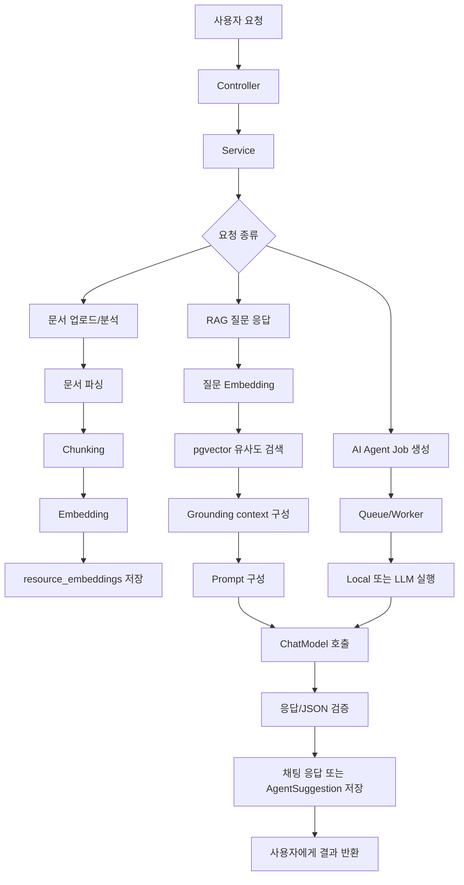
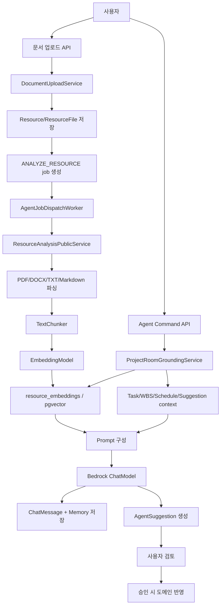

# Bubli 백엔드 AI 기능 종합 기술 분석서

작성 기준: 2026-07-09

분석 대상: 현재 백엔드 코드의 AI, RAG, Embedding, Vector DB, 문서 분석, 챗봇, Agent 기능

## 목차

1. 프로젝트 AI 기능 전체 개요
2. 전체 코드 흐름 요약
3. 주요 패키지와 파일 구조
4. 기능별 상세 설명
5. API 기준 설명
6. 핵심 코드 해설
7. 처음부터 구현한다면 작성 순서
8. 데이터 흐름 예시
9. 설정 파일 분석
10. 현재 코드의 장점과 문제점
11. 면접 / 포트폴리오 설명 요약
12. 최종 요약

---

## 1. 프로젝트 AI 기능 전체 개요

이 프로젝트의 AI 기능은 단순히 사용자의 질문을 LLM에 전달해 답변을 받는 구조가 아니다. 프로젝트룸에 업로드된 문서, TODO, WBS, 일정, 기존 AI 제안 등을 근거 자료로 모으고, 그 근거를 바탕으로 답변하거나 업무 초안을 생성한다.

현재 코드에서 확인되는 AI 관련 주요 기능은 다음과 같다.

| 기능 | 사용자 입장에서 하는 일 | 백엔드 기술 요소 |
|---|---|---|
| 문서 업로드 및 자동 분석 | 계약서/요구사항 문서를 업로드하면 분석 job이 생성된다. | `DocumentController`, `DocumentUploadService`, `ResourceAnalysisPublicService`, `AgentJobService` |
| 문서 파싱 | PDF, TXT, Markdown, DOCX에서 텍스트를 추출한다. | PDFBox, Apache POI, UTF-8 text reader |
| Chunking | 긴 문서를 검색하기 좋은 작은 텍스트 조각으로 나눈다. | `TextChunker` |
| Embedding | 문서 chunk와 사용자 질문을 숫자 벡터로 변환한다. | Spring AI `EmbeddingModel`, Bedrock Titan |
| Vector DB 검색 | 질문과 의미가 가까운 문서 chunk를 찾는다. | PostgreSQL + pgvector, `resource_embeddings` |
| RAG 기반 챗봇 | 검색된 문서와 업무 데이터를 prompt에 넣고 답변을 생성한다. | `ProjectRoomAgentCommandService`, `ProjectRoomGroundingService`, `ChatModel` |
| AI Agent Job | 요구사항, 작업, WBS, 질문, 문서 검토, 요약, 문서 초안 생성을 비동기로 처리한다. | `AiJobCommandController`, `AgentJobDispatchWorker`, `LlmAgentJobExecutionPort` |
| Suggestion Review | AI가 만든 결과를 바로 반영하지 않고 사용자가 승인/수정/보류/거절한다. | `AgentSuggestionController`, `AgentSuggestionCommandService`, `AgentSuggestionDomainApplyService` |
| Generated Document | 문서 초안 suggestion 승인 시 생성 문서로 저장한다. | `GeneratedDocumentService`, `GeneratedDocumentController` |
| Daily Summary | 하루 요약 초안을 만들고 승인 시 daily summary draft로 저장한다. | `DailySummaryPublicService`, `DailySummaryController` |
| Memory Summary | 프로젝트룸 agent 응답을 room memory draft로 남긴다. | `RoomMemoryPublicService` |

전체 AI 처리 흐름을 크게 보면 다음과 같다.

```text
사용자 요청
-> Controller
-> Service
-> 문서 처리 / 검색 / Agent job 생성
-> Chunking / Embedding / Vector DB 조회
-> Grounding context 구성
-> Prompt 구성
-> LLM 호출
-> JSON 검증 또는 일반 답변 가공
-> Agent suggestion / chat message / memory / generated document 저장
-> API 응답 반환
```

Mermaid로 보면 다음과 같다.



---

## 2. 전체 코드 흐름 요약

### 2.1 문서 업로드 및 분석 흐름

사용자가 프로젝트룸에 계약서나 요구사항 문서를 업로드하면 다음 순서로 처리된다.

```text
POST /api/project-rooms/{roomId}/contract-documents
-> DocumentController.uploadContractDocument(...)
-> DocumentUploadService.uploadContractDocument(...)
-> ProjectMembershipPublicService.assertActiveMember(...)
-> DocumentFileInspector.inspect(...)
-> StoragePublicService.store(...)
-> Resource / ResourceFile / ResourceVersion 저장
-> autoAnalyze=true이면 AgentJobPublicService.createAnalyzeResourceJob(...)
-> agent_jobs에 ANALYZE_RESOURCE job 저장
-> dispatch/worker가 이후 분석 실행
```

핵심 포인트:

- 업로드 API는 `DocumentController`가 받는다.
- 실제 저장과 중복 검사, 파일 검사, storage 저장은 `DocumentUploadService`가 담당한다.
- `autoAnalyze=true`이면 문서 업로드 직후 `ANALYZE_RESOURCE` agent job이 생성된다.
- 분석 job이 실행되면 `ResourceAnalysisPublicService`가 파일에서 텍스트를 읽고, summary, ai document, embedding, relation을 만든다.

분석 job 실행 시 내부 흐름은 다음과 같다.

```text
AgentJobDispatchWorker.processNextQueuedJob()
-> AgentJobExecutionPort.execute(...)
-> ANALYZE_RESOURCE이면 ResourceAnalysisPublicService.loadAnalysisSourceForJob(...)
-> PDF/TXT/Markdown/DOCX 텍스트 추출
-> LLM mode이면 LlmAgentJobExecutionPort가 분석 prompt 생성 및 LLM 호출
-> ResourceAnalysisPublicService.completeAnalysisForJob(...)
-> resource_summaries 저장
-> ai_documents 저장 또는 갱신
-> ResourceEmbeddingIndexPublicService.index(...)
-> resource_embeddings 저장
-> ResourceRelationIndexPublicService.rebuildRelations(...)
-> resource 상태 ANALYZED
```

### 2.2 질문 응답 흐름

프로젝트룸 agent command API는 RAG 챗봇 역할을 한다.

```text
POST /api/project-rooms/{roomId}/agent/commands
-> ProjectRoomAgentCommandController.execute(...)
-> ProjectRoomAgentCommandService.execute(...)
-> ProjectMembershipPublicService.assertActiveMember(...)
-> ProjectRoomGroundingService.retrieve(...)
-> ResourceSemanticSearchPublicService.search(...)
-> resource_embeddings에서 유사 chunk 검색
-> TODO/WBS/일정/기존 suggestion도 context에 추가
-> prompt(...)로 LLM prompt 구성
-> ChatModel.call(prompt)
-> ChatMessagePublicService.createRoomAgentResponse(...)
-> RoomMemoryPublicService.createDraft(...)
-> ProjectRoomAgentCommandResponse 반환
```

이 흐름에서 중요한 점은 문서만 검색하는 것이 아니라는 점이다. `ProjectRoomGroundingService`는 질문 의도를 보고 다음 자료를 함께 모을 수 있다.

- 문서 chunk
- 최근 문서 summary
- TODO/Task
- WBS
- 일정
- 기존 AI suggestion

따라서 이 프로젝트의 챗봇은 "문서 RAG"와 "프로젝트 관리 데이터 grounding"을 함께 사용하는 구조다.

### 2.3 AI job 비동기 실행 흐름

요구사항 생성, TODO 생성, WBS 생성, 질문 생성, 계약 검토, 일일 요약, 문서 초안은 모두 agent job 형태로 만들어진다.

```text
POST /api/ai/generate-tasks
-> AiJobCommandController.generateTasks(...)
-> AiJobCommandService.createGenerateTasksJob(...)
-> ProjectMembershipPublicService.assertActiveMember(...)
-> AgentJobService.create(...)
-> agent_jobs 저장
-> dispatch outbox/queue 기록
-> AgentJobDispatchWorker가 queue poll
-> AgentJobExecutionPort.execute(...)
-> LocalAgentJobExecutionPort 또는 LlmAgentJobExecutionPort 실행
-> AgentJobExecutionSuggestionRecorder가 agent_suggestions 저장
-> AgentJobExecutionResultRecorder가 job 상태 SUCCEEDED/FAILED 기록
```

실행 모드는 설정에 따라 달라진다.

| 모드 | 의미 |
|---|---|
| `local` | 외부 LLM 없이 deterministic 결과를 생성하는 개발/테스트용 실행 |
| `llm` | Bedrock ChatModel을 호출하는 실제 AI 실행 |
| `noop` | job만 만들고 실행 결과는 만들지 않는 모드 |

### 2.4 suggestion 승인 후 업무 도메인 반영 흐름

AI가 만든 결과는 곧바로 업무 데이터가 되지 않는다. 먼저 `agent_suggestions`에 초안으로 저장되고, 사용자가 검토한다.

```text
PATCH /api/agent/suggestions/{suggestionId}
-> AgentSuggestionController.review(...)
-> AgentSuggestionCommandService.review(...)
-> action=APPROVE이면 AgentSuggestionDomainApplyService.applyApprovedSuggestion(...)
-> suggestionType에 따라 Task/WBS/Schedule/DailySummary/GeneratedDocument/Memo 생성
-> suggestion payload에 appliedResult 기록
-> AgentSuggestionResponse 반환
```

type별 반영 정책은 다음과 같다.

| Suggestion type | 승인 시 처리 |
|---|---|
| `TASK`, `TODO` | room task 또는 personal task 생성 |
| `WBS` | WBS item 생성, 날짜가 있으면 schedule도 생성 |
| `SCHEDULE` | schedule 생성 |
| `DAILY_SUMMARY` | daily summary draft upsert |
| `DOCUMENT_DRAFT` | generated document 생성 |
| `MEMO` | memo 생성 |
| `REQUIREMENT` | 별도 요구사항 테이블이 없어 confirmed suggestion으로 보존 |
| `QUESTION`, `REVIEW_ITEM` | 확인 항목으로 보존 |
| `CONTRACT_FIELD`, `CONTRACT_REVIEW` | 계약 참고값/검토 노트로 보존, 법적 판단은 하지 않음 |

---

## 3. 주요 패키지와 파일 구조

### 3.1 `com.bubli.agent`

Agent job, LLM 실행, suggestion, 챗봇 command, 생성 문서, AI 문서 조회를 담당한다.

| 파일 / 클래스 | 역할 | 주요 메서드 | 연결되는 클래스 |
|---|---|---|---|
| `AiJobCommandController` | AI job 생성 API | `analyzeResource`, `generateTasks`, `draftDocument` | `AiJobCommandService` |
| `AgentJobController` | job 조회, event 조회, resource search API | `getJob`, `getJobEvents`, `searchResource` | `AgentJobQueryService`, `ResourceSemanticSearchPublicService` |
| `ProjectRoomAgentCommandController` | 프로젝트룸 agent command API | `execute` | `ProjectRoomAgentCommandService` |
| `AgentSuggestionController` | suggestion 조회/검토 API | `findMine`, `findRoomSuggestions`, `review` | `AgentSuggestionQueryService`, `AgentSuggestionCommandService` |
| `AiJobCommandService` | job 생성 전 권한/locale/requestPayload 구성 | `createGenerateTasksJob`, `createDraftDocumentJob` | `AgentJobService` |
| `ProjectRoomAgentCommandService` | RAG 답변 생성 및 채팅 메시지 저장 | `execute`, `answer`, `createSuggestions` | `ProjectRoomGroundingService`, `ChatModel` |
| `ProjectRoomGroundingService` | 문서/업무 데이터 grounding context 생성 | `retrieve` | `ResourceSemanticSearchPublicService`, task/wbs/schedule services |
| `ProjectRoomRagGroundingService` | 문서 RAG 전용 context 생성 | `retrieve` | `ResourceSemanticSearchPublicService` |
| `LlmAgentJobExecutionPort` | Bedrock ChatModel 기반 job 실행 | `execute`, `callAndParseJson` | `ChatModel`, `AgentAnalysisResultJsonParser` |
| `AgentJobDispatchWorker` | queue에서 job을 꺼내 실행 | `processNextQueuedJob` | `AgentJobExecutionPort`, recorders |
| `AgentAnalysisResultJsonParser` | LLM JSON 응답 파싱/검증 | `parse` | `AgentAnalysisResultValidator` |
| `AgentSuggestionDomainApplyService` | 승인된 suggestion을 업무 도메인에 반영 | `applyApprovedSuggestion` | task/wbs/schedule/daily summary/generated document services |

### 3.2 `com.bubli.resource`

리소스, 문서 업로드, 파일 검사, 문서 분석, chunking, embedding, semantic search를 담당한다.

| 파일 / 클래스 | 역할 | 주요 메서드 | 연결되는 클래스 |
|---|---|---|---|
| `DocumentController` | 계약/요구사항 문서 업로드 API | `uploadContractDocument` | `DocumentUploadService` |
| `ResourceController` | resource 목록/상세/summary/related/file API | 여러 resource API | `ResourceService`, `ResourcePublicService` |
| `DocumentUploadService` | 업로드 파일 검사, storage 저장, resource row 생성 | `uploadContractDocument` | `DocumentFileInspector`, `StoragePublicService`, `AgentJobPublicService` |
| `DocumentFileInspector` | 확장자, 파일 크기, 내용 유효성, checksum 검사 | `inspect` | `MultipartFile` |
| `ResourceAnalysisPublicService` | 파일 텍스트 추출, summary/aiDocument/embedding 저장 | `loadAnalysisSourceForJob`, `completeAnalysisForJob` | `ResourceEmbeddingIndexPublicService` |
| `TextChunker` | 텍스트를 chunk로 분리 | `splitPages`, `split` | embedding index service |
| `ResourceEmbeddingIndexPublicService` | chunk embedding 생성 및 DB 저장 | `index`, `indexExtractedText` | `EmbeddingModel`, `ResourceEmbeddingRepository` |
| `EmbeddingVectorFormatter` | float 배열을 pgvector literal로 변환 | `toVectorLiteral` | embedding/search service |
| `ResourceSemanticSearchPublicService` | 질문 embedding 및 vector search | `search`, `searchRoomSharedResources` | `ResourceEmbeddingRepository` |
| `ResourceEmbeddingRepository` | native SQL로 pgvector insert/search 수행 | `insertEmbedding`, `searchRoomShared`, `searchPersonal` | PostgreSQL pgvector |

### 3.3 `com.bubli.chat`

일반 채팅방과 프로젝트룸 agent 응답 저장에 사용된다.

| 파일 / 클래스 | 역할 | 주요 메서드 |
|---|---|---|
| `ChatController` | 채팅방/메시지 API | room 생성, message 전송, read 처리 |
| `ChatMessagePublicService` | 다른 도메인에서 채팅 메시지 생성 | `createRoomAgentResponse` |
| `ChatService` | 채팅방 생성/조회, 멤버 처리 | 여러 chat domain method |
| `ChatTypingService` | typing event 처리 | typing 관련 method |

### 3.4 `com.bubli.memory`

AI 응답 이후 기억/요약성 데이터를 저장한다.

| 파일 / 클래스 | 역할 | 주요 메서드 |
|---|---|---|
| `RoomMemorySummaryController` | 프로젝트룸 memory summary API | room memory 조회/생성 |
| `DailySummaryController` | daily summary 조회/수정 API | `GET /api/daily-summaries`, `PATCH /api/daily-summaries/{summaryId}` |
| `RoomMemoryPublicService` | agent 응답 후 memory draft 생성 | `createDraft` |
| `DailySummaryPublicService` | AI suggestion 승인 시 daily summary draft 저장 | `upsertDraft` |

---

## 4. 기능별 상세 설명

### 4.1 문서 파싱 기능

지원 파일 형식은 코드 기준으로 다음과 같다.

| 형식 | 검사 위치 | 추출 위치 | 사용 라이브러리 |
|---|---|---|---|
| PDF | `DocumentFileInspector.fileType`, PDF magic header 검사 | `ResourceAnalysisPublicService.extractPdf` | Apache PDFBox |
| TXT | 확장자 `.txt`, UTF-8 decode 검사 | `extractUtf8Text` | Java UTF-8 |
| Markdown | `.md`, `.markdown`, UTF-8 decode 검사 | `extractUtf8Text` | Java UTF-8 |
| DOCX | `XWPFDocument`로 열 수 있는지 검사 | `extractDocx` | Apache POI |

문서 업로드 시 `DocumentFileInspector.inspect(...)`가 먼저 실행된다.

- 파일이 비어 있으면 400 계열 오류
- 50MB를 넘으면 `RESOURCE_413_001`
- 지원하지 않는 확장자 또는 깨진 파일이면 `RESOURCE_415_001`
- SHA-256 checksum을 계산해 같은 프로젝트룸 내 중복 파일 업로드를 막는다.

분석 시 실제 텍스트 추출은 `ResourceAnalysisPublicService.extract(...)`에서 처리한다.

```java
private ExtractedDocument extract(ResourceFile resourceFile) {
    try (InputStream inputStream = storageService.open(resourceFile.getStorageKey())) {
        if (isPdf(resourceFile)) {
            return extractPdf(inputStream);
        }
        if (isText(resourceFile) || isMarkdown(resourceFile)) {
            return extractUtf8Text(inputStream);
        }
        if (isDocx(resourceFile)) {
            return extractDocx(inputStream);
        }
        throw new BusinessException(ErrorCode.RESOURCE_415_001);
    } catch (IOException e) {
        throw new BusinessException(ErrorCode.RESOURCE_500_001);
    }
}
```

PDF는 페이지별로 `PDFTextStripper`를 실행해 `TextPage(pageNumber, text)`를 만든다. TXT/Markdown/DOCX는 페이지 개념이 없어 `pageNumber=null`로 처리된다.

개선 가능한 부분:

- OCR은 현재 코드에서 확인되지 않는다.
- HWP 파싱은 현재 코드에서 확인되지 않는다.
- PDF 표/레이아웃 복원은 PDFBox 텍스트 추출 수준이라 복잡한 문서는 품질 편차가 날 수 있다.

### 4.2 Chunking 기능

Chunk는 긴 문서를 검색과 LLM 입력에 적합하도록 나눈 작은 텍스트 조각이다. 긴 문서 전체를 embedding하거나 prompt에 넣으면 비용이 크고 검색 정확도도 떨어진다. 그래서 문서를 chunk로 나눈 뒤 각 chunk를 embedding한다.

현재 구현은 `TextChunker`에 있다.

- 최대 chunk 길이: `1200` characters
- overlap: `200` characters
- 분리 우선순위: 문단 경계 `\n\n` -> 문장 경계 `. `, `? `, `! ` -> 공백 -> 강제 절단
- metadata: `chunkIndex`, `startOffset`, `endOffset`, `pageNumber`, `startLine`, `endLine`

예시 원문:

```text
계약 종료 조건은 다음과 같다.
계약 종료 30일 전까지 서면으로 통보해야 한다.
통보가 없으면 계약은 동일 조건으로 연장된다.
```

예상 chunk 결과:

```text
Chunk 0
- text: 계약 종료 조건은 다음과 같다. 계약 종료 30일 전까지 서면으로 통보해야 한다. 통보가 없으면 계약은 동일 조건으로 연장된다.
- chunkIndex: 0
- pageNumber: PDF라면 실제 페이지 번호, TXT/DOCX라면 null
- startOffset/endOffset: 원문 내 위치
- startLine/endLine: 원문 내 줄 번호
```

짧은 문서는 하나의 chunk가 되고, 긴 문서는 1200자 단위로 나뉘되 이전 chunk 끝부분 200자를 다음 chunk에 일부 겹쳐 넣는다. 이 overlap은 문장 경계에 걸린 정보가 검색에서 빠지는 것을 줄인다.

### 4.3 Embedding 기능

Embedding은 텍스트를 숫자 배열로 바꾸는 작업이다. 이 프로젝트에서는 문서 chunk와 사용자 질문을 같은 embedding model로 벡터화한 뒤, 벡터끼리의 cosine distance를 비교해 의미적으로 가까운 문서를 찾는다.

설정 기준:

- `application-ai.yml`
- `spring.ai.model.embedding=bedrock-titan`
- 기본 모델: `amazon.titan-embed-text-v2:0`
- dimension: `1024`

문서 chunk embedding은 `ResourceEmbeddingIndexPublicService.index(...)`에서 발생한다.

```java
List<TextChunker.TextChunk> chunks = textChunker.splitPages(pages);
resourceEmbeddingRepository.deleteAllByResourceId(resource.getId());

List<ResourceEmbedding> embeddings = chunks.stream()
        .map(chunk -> toEmbedding(resource, resourceFile, chunk, embeddingModel.embed(chunk.text())))
        .toList();
embeddings.forEach(this::insertEmbedding);
```

질문 embedding은 `ResourceSemanticSearchPublicService.search(...)`에서 발생한다.

```java
String queryEmbedding = embeddingVectorFormatter.toVectorLiteral(embeddingModel.embed(normalizedQuery));
```

`EmbeddingVectorFormatter`는 embedding 결과가 1024차원인지, `NaN`이나 `Infinity`가 없는지 검사한 뒤 pgvector literal 문자열로 바꾼다.

```java
private static final int EXPECTED_EMBEDDING_DIMENSIONS = 1024;
```

이 검사가 중요한 이유:

- embedding dimension이 DB의 vector dimension과 다르면 insert/search가 실패한다.
- 비정상 숫자가 섞이면 pgvector cast 또는 검색이 실패할 수 있다.
- 모델 설정과 DB 설정 불일치를 빠르게 발견할 수 있다.

### 4.4 Vector DB / Vector Store 기능

현재 코드에서 실제 RAG 검색에 사용하는 저장소는 PostgreSQL + pgvector의 `resource_embeddings` 테이블이다.

Spring AI의 `spring.ai.vectorstore.pgvector` 설정도 존재하지만, 현재 검색 코드는 `ResourceEmbeddingRepository`의 native query로 `resource_embeddings`를 직접 조회한다. 즉, 문서 RAG의 주요 vector DB 테이블은 `vector_store`가 아니라 `resource_embeddings`다.

`V7__resource_embeddings_and_legacy_rag_cleanup.sql`에서 확인되는 설정:

```sql
CREATE EXTENSION IF NOT EXISTS vector;

CREATE INDEX IF NOT EXISTS idx_resource_embeddings_vector_hnsw
    ON resource_embeddings
    USING hnsw (embedding vector_cosine_ops);
```

주요 컬럼 의미:

| 컬럼 | 의미 |
|---|---|
| `id` | embedding row id |
| `resource_id` | 원본 resource id |
| `owner_id` | 개인 자료 검색 범위 |
| `room_id` | 프로젝트룸 자료 검색 범위 |
| `visibility` | `PERSONAL` 또는 `ROOM_SHARED` |
| `chunk_index` | 문서 내 chunk 순서 |
| `chunk_text` | 검색 결과로 반환할 원문 chunk |
| `embedding` | 1024차원 vector |
| `chunk_metadata` | page/line/offset/originalName/mimeType 등 JSON metadata |

유사도 검색은 다음 방식이다.

```sql
ORDER BY embedding <=> CAST(:queryEmbedding AS vector)
```

`<=>`는 pgvector의 cosine distance 연산자다. Repository에서는 응답 점수로 `1 - distance`를 사용한다.

```sql
1 - (embedding <=> CAST(:queryEmbedding AS vector)) AS similarityScore
```

### 4.5 RAG 검색 기능

RAG는 Retrieval-Augmented Generation의 약자다. 이 프로젝트에서는 다음 순서로 작동한다.

```text
사용자 질문
-> 질문 텍스트 정규화
-> 질문 embedding 생성
-> resource_embeddings에서 유사 chunk 검색
-> 검색된 chunk를 grounding context로 구성
-> prompt에 넣음
-> LLM이 근거 기반 답변 생성
```

검색 진입점은 `ResourceSemanticSearchPublicService.search(...)`다.

지원 검색 범위:

| 메서드 | 용도 |
|---|---|
| `search` | PERSONAL 또는 ROOM_SHARED 범위 semantic search |
| `searchRoomSharedResources` | 특정 resourceIds 안에서 semantic search |
| `searchRoomSharedResourceKeywords` | 특정 resourceIds 안에서 keyword search |
| `searchRoomSharedKeywords` | 프로젝트룸 전체 keyword search |
| `loadRoomSharedResourceChunks` | 특정 resource의 대표 chunk 로드 |

검색 결과는 `ResourceSearchHit` 형태로 반환된다.

주요 필드:

- `embeddingId`
- `resourceId`
- `chunkIndex`
- `chunkText`
- `pageNumber`
- `startLine`
- `endLine`
- `startOffset`
- `endOffset`
- `originalName`
- `similarityScore`

RAG 정확도를 높이기 위해 `ProjectRoomGroundingService`는 semantic search만 쓰지 않는다.

- 제목 기반 resource match
- keyword 기반 검색
- title-scoped semantic search
- 최근 resource summary fallback
- TODO/WBS/일정/agent suggestion context

이 구조는 사용자가 "계약서에 뭐라고 되어 있어?"처럼 문서를 묻는 경우뿐 아니라, "남은 작업 알려줘", "WBS 진행 상황 알려줘" 같은 관리 데이터 질문도 처리하기 위한 것이다.

한계:

- 검색 품질 평가 지표(hit@K, MRR 등)는 코드에서 확인되지 않는다.
- similarity threshold는 설정값과 일부 상수로 관리되지만, 실제 corpus 기반 튜닝 결과는 코드에서 확인되지 않는다.
- embedding model이 비활성화된 local 기본 설정에서는 semantic search가 불가능하다.

### 4.6 Prompt 구성 기능

프로젝트룸 챗봇 prompt는 `ProjectRoomAgentCommandService.prompt(...)`에서 만들어진다.

핵심 지시:

- "Use ONLY the project documents and management data"
- 일반 지식이나 추측을 factual evidence로 사용하지 말 것
- 근거가 부분적이면 확인된 사실과 부족한 정보를 분리할 것
- raw retrieval block, resourceId, metadata line을 답변 본문에 출력하지 말 것

Agent job용 LLM prompt는 `LlmAgentJobExecutionPort`에서 만든다.

대표 prompt 생성 메서드:

| 메서드 | 용도 |
|---|---|
| `analyzeResourcePrompt(...)` | 문서 분석용 JSON 결과 요청 |
| `promptFor(...)` | 요구사항/TODO/WBS/질문/검토/요약/문서 초안용 JSON 결과 요청 |
| `jsonRepairPrompt(...)` | LLM 응답이 JSON contract를 어겼을 때 재요청 |

Agent job prompt는 JSON만 반환하도록 강하게 요구한다.

```text
Return only valid JSON matching schemaVersion ...
Do not include markdown fences or explanatory text.
```

Prompt 개선 가능성:

- 현재 prompt 문자열이 Java 코드 안에 길게 하드코딩되어 있다.
- prompt version은 기록하지만, prompt template 파일 분리나 A/B test 구조는 코드에서 확인되지 않는다.
- locale별 답변 지시가 있으나 일부 소스 문자열은 인코딩 깨짐이 의심된다.

### 4.7 Chatbot / LLM 응답 생성 기능

현재 LLM 연결은 Spring AI의 `ChatModel`을 통해 이루어진다. `application-ai.yml` 기준으로 Bedrock Converse가 사용된다.

설정:

```yaml
spring:
  ai:
    model:
      chat: bedrock-converse
    bedrock:
      converse:
        chat:
          options:
            model: ${BEDROCK_CHAT_MODEL_ID:apac.anthropic.claude-3-haiku-20240307-v1:0}
            temperature: ${BEDROCK_CHAT_TEMPERATURE:0.2}
            max-tokens: ${BEDROCK_CHAT_MAX_TOKENS:3000}
```

프로젝트룸 챗봇 답변 생성 흐름:

```text
ProjectRoomAgentCommandService.execute(...)
-> ProjectRoomGroundingService.retrieve(...)
-> answer(...)
-> ChatModel.call(prompt)
-> AgentQuerySupport.removeAppendedNoAnswer(...)
-> persistResponse(...)
-> ChatMessagePublicService.createRoomAgentResponse(...)
-> RoomMemoryPublicService.createDraft(...)
```

응답 DTO는 `ProjectRoomAgentCommandResponse`이며, 내부에 다음 결과가 포함된다.

- `message`: agent 응답 chat message
- `memorySummary`: 생성된 room memory draft
- `suggestions`: SUGGEST mode에서 생성된 suggestion 목록

LLM 호출 실패 시:

- `LLM_FAILED` fallbackReason을 남긴다.
- 근거가 없으면 `NO_GROUNDING`
- ChatModel bean이 없으면 `NO_CHAT_MODEL`

### 4.8 AI Agent / Tool 구조

이 프로젝트에는 OpenAI function calling 같은 "도구 호출을 LLM이 선택하는 구조"는 코드에서 확인되지 않는다. 대신 백엔드가 명시적으로 job type과 실행 포트를 선택하는 Agent 구조가 있다.

Agent와 일반 챗봇의 차이:

| 구분 | 일반 프로젝트룸 챗봇 | Agent job |
|---|---|---|
| 목적 | 질문에 답변 | 분석/제안/문서 초안/요약 생성 |
| 진입 API | `/api/project-rooms/{roomId}/agent/commands` | `/api/ai/...` |
| 실행 방식 | 동기 응답 생성 | 비동기 job/worker |
| 결과 저장 | chat message, memory summary | agent job, suggestion, summary, ai document |
| 사용자 검토 | SUGGEST mode에서 suggestion 생성 가능 | suggestion review workflow 중심 |

Agent job 실행 구조:

```text
agent_jobs row
-> queue/outbox
-> AgentJobDispatchWorker
-> AgentJobExecutionPort
-> LocalAgentJobExecutionPort 또는 LlmAgentJobExecutionPort 또는 NoopAgentJobExecutionPort
-> AgentJobExecutionOutcome
-> AgentJobExecutionSuggestionRecorder
-> AgentJobExecutionResultRecorder
```

모델 호출 로그는 `AgentJobExecutionModelCallLogRecorder`를 통해 저장된다. `LlmAgentJobExecutionPort`는 prompt token/response token을 정확한 provider usage가 아니라 문자 길이 기반 추정치로 계산한다.

---

## 5. API 기준 설명

### 5.1 `POST /api/project-rooms/{roomId}/contract-documents`

프로젝트룸 계약/요구사항 문서 업로드 API다.

- Controller: `DocumentController.uploadContractDocument`
- Service: `DocumentUploadService.uploadContractDocument`
- Content-Type: `multipart/form-data`

Request:

```http
POST /api/project-rooms/{roomId}/contract-documents
Content-Type: multipart/form-data

documentType=CONTRACT
file=@contract.pdf
autoAnalyze=true
```

처리 흐름:

```text
권한 확인
-> 파일 검사
-> checksum 중복 검사
-> storage 저장
-> Resource/ResourceFile/ResourceVersion 저장
-> autoAnalyze이면 ANALYZE_RESOURCE job 생성
```

성공 응답은 `ContractDocumentUploadResponse`를 감싼 `ApiResponse`다. 세부 필드는 DTO 구현에 따른다.

실패 예:

- 지원하지 않는 파일: `RESOURCE_415_001`
- 파일 크기 초과: `RESOURCE_413_001`
- 중복 파일: `RESOURCE_409_001`
- 권한 없음: membership service의 권한 예외

### 5.2 `POST /api/ai/analyze-resource`

이미 등록된 resource를 분석하는 job을 생성한다.

- Controller: `AiJobCommandController.analyzeResource`
- Service: `AiJobCommandService.createAnalyzeResourceJob`

Request:

```json
{
  "resourceId": "00000000-0000-0000-0000-000000000000"
}
```

Response:

```json
{
  "data": {
    "jobId": "uuid",
    "jobType": "ANALYZE_RESOURCE",
    "status": "PENDING",
    "resourceId": "uuid",
    "roomId": "uuid"
  }
}
```

실제 응답 필드는 `AgentJobResponse` 기준이다.

### 5.3 AI job 생성 API 목록

아래 API들은 공통적으로 `AiJobCommandController` -> `AiJobCommandService` -> `AgentJobService.create(...)`로 이어진다.

| API | Job type | Request 핵심 |
|---|---|---|
| `POST /api/ai/generate-requirements` | `GENERATE_REQUIREMENTS` | `roomId` |
| `POST /api/ai/generate-tasks` | `GENERATE_TASKS` | `roomId` |
| `POST /api/ai/generate-wbs` | `GENERATE_WBS` | `roomId` |
| `POST /api/ai/generate-questions` | `GENERATE_QUESTIONS` | `roomId` |
| `POST /api/ai/review-contract-documents` | `REVIEW_CONTRACT_DOCUMENTS` | `roomId` |
| `POST /api/ai/summarize-day` | `DAILY_SUMMARY` | `summaryDate`, `timezone` optional |
| `POST /api/ai/draft-document` | `DRAFT_DOCUMENT` | `roomId`, `documentType`, `sourceResourceIds`, `instruction` |

예시:

```http
POST /api/ai/generate-tasks
Content-Type: application/json
```

```json
{
  "roomId": "00000000-0000-0000-0000-000000000000"
}
```

### 5.4 `POST /api/ai/search-resource`

사용자의 query를 embedding하고 vector DB에서 관련 resource chunk를 검색한다.

- Controller: `AgentJobController.searchResource`
- Service: `ResourceSemanticSearchPublicService.search`

Request:

```json
{
  "scope": "ROOM_SHARED",
  "roomId": "00000000-0000-0000-0000-000000000000",
  "query": "계약 종료 통보 기한",
  "topK": 5
}
```

Response:

```json
{
  "data": {
    "hits": [
      {
        "resourceId": "uuid",
        "chunkIndex": 0,
        "chunkText": "계약 종료 30일 전까지 서면으로 통보해야 한다.",
        "pageNumber": 2,
        "similarityScore": 0.82
      }
    ]
  }
}
```

정확한 필드는 `SearchResourceResponse`와 `ResourceSearchHit` 기준이다.

### 5.5 `POST /api/project-rooms/{roomId}/agent/commands`

프로젝트룸 RAG 챗봇 API다.

- Controller: `ProjectRoomAgentCommandController.execute`
- Service: `ProjectRoomAgentCommandService.execute`

Request:

```json
{
  "message": "계약 종료는 언제까지 알려야 해?",
  "mode": "ANSWER",
  "resourceIds": []
}
```

Mode:

| mode | 의미 |
|---|---|
| `ANSWER` | 근거 기반 답변 |
| `SUMMARIZE` | 프로젝트 context 요약 |
| `SUGGEST` | 답변과 함께 suggestion draft 생성 |

Response:

```json
{
  "data": {
    "message": {
      "messageType": "AGENT_RESPONSE",
      "body": {
        "text": "프로젝트 문서 기준으로 계약 종료 30일 전까지 서면 통보가 필요합니다.",
        "grounded": true,
        "citations": [
          {
            "sourceType": "DOCUMENT",
            "resourceId": "uuid",
            "pageNumber": 2,
            "quote": "계약 종료 30일 전까지 서면으로 통보해야 한다."
          }
        ]
      }
    },
    "memorySummary": {
      "status": "DRAFT"
    },
    "suggestions": []
  }
}
```

위 JSON은 이해를 돕기 위한 예시이며, 실제 필드는 DTO와 `responseBody(...)` 구성에 따른다.

### 5.6 결과 조회 / 검토 API

| API | 역할 | Controller |
|---|---|---|
| `GET /api/agent-jobs/{jobId}` | job 상태 조회 | `AgentJobController` |
| `GET /api/agent-jobs/{jobId}/events` | job event 조회 | `AgentJobController` |
| `GET /api/project-rooms/{roomId}/agent/suggestions` | room suggestion 조회 | `AgentSuggestionController` |
| `PATCH /api/agent/suggestions/{suggestionId}` | suggestion 승인/수정/보류/거절/삭제 | `AgentSuggestionController` |
| `GET /api/resources/{resourceId}/ai-document` | 분석된 AI 문서 정보 조회 | `AiDocumentController` |
| `GET /api/generated-documents/{documentId}` | 생성 문서 상세 조회 | `GeneratedDocumentController` |

Suggestion 검토 예시:

```json
{
  "action": "APPROVE"
}
```

수정 예시:

```json
{
  "action": "EDIT",
  "editedContent": {
    "title": "계약 종료 통보 일정 확인",
    "description": "계약 종료 30일 전 서면 통보 일정을 TODO로 등록한다."
  }
}
```

---

## 6. 핵심 코드 해설

### 6.1 `TextChunker.splitPages(...)`

위치: `src/main/java/com/bubli/resource/service/TextChunker.java`

```java
public List<TextChunk> splitPages(List<TextPage> pages) {
    if (pages == null || pages.isEmpty()) {
        return List.of();
    }

    List<TextChunk> chunks = new ArrayList<>();
    for (TextPage page : pages) {
        splitPage(page, chunks);
    }
    return chunks;
}
```

언제 호출되는가:

- 문서 분석 후 embedding을 만들 때 `ResourceEmbeddingIndexPublicService.index(...)`에서 호출된다.

파라미터:

- `pages`: PDF는 페이지별 텍스트, TXT/Markdown/DOCX는 `pageNumber=null`인 단일 page에 가까운 구조

반환값:

- `TextChunk` 목록
- 각 chunk는 index, text, offset, page number, line number를 가진다.

없으면 생기는 문제:

- 문서 전체를 하나의 embedding으로 저장해야 해서 검색 정확도가 떨어진다.
- LLM prompt에 너무 긴 문서를 넣게 되어 비용과 지연 시간이 증가한다.

### 6.2 `ResourceEmbeddingIndexPublicService.index(...)`

위치: `src/main/java/com/bubli/resource/service/ResourceEmbeddingIndexPublicService.java`

```java
public IndexResult index(Resource resource, ResourceFile resourceFile, List<TextChunker.TextPage> pages) {
    EmbeddingModel embeddingModel = embeddingModelProvider.getIfAvailable();
    if (embeddingModel == null) {
        return IndexResult.skipped();
    }
    List<TextChunker.TextChunk> chunks = textChunker.splitPages(pages);
    resourceEmbeddingRepository.deleteAllByResourceId(resource.getId());

    List<ResourceEmbedding> embeddings = chunks.stream()
            .map(chunk -> toEmbedding(resource, resourceFile, chunk, embeddingModel.embed(chunk.text())))
            .toList();
    embeddings.forEach(this::insertEmbedding);
    return IndexResult.indexed(embeddings.size());
}
```

언제 호출되는가:

- `ResourceAnalysisPublicService.completeAnalysisForJob(...)`에서 문서 분석 결과 저장 후 호출된다.

파라미터:

- `resource`: 어떤 문서인지, owner/room/visibility 정보를 제공한다.
- `resourceFile`: 원본 파일명, mime type 등 metadata를 제공한다.
- `pages`: 추출된 텍스트 페이지 목록이다.

반환값:

- `IndexResult.indexed(chunkCount)` 또는 `IndexResult.skipped()`

중요한 동작:

- 기존 embedding을 먼저 삭제한다.
- 새 chunk를 만든다.
- chunk마다 `embeddingModel.embed(chunk.text())`를 호출한다.
- pgvector literal로 변환해 `resource_embeddings`에 저장한다.

### 6.3 `ResourceSemanticSearchPublicService.search(...)`

위치: `src/main/java/com/bubli/resource/service/ResourceSemanticSearchPublicService.java`

```java
public List<ResourceSearchHit> search(
        UUID userId,
        ResourceSearchScope scope,
        UUID roomId,
        String query,
        Integer topK
) {
    ResourceSearchScope normalizedScope = scope == null ? ResourceSearchScope.ROOM_SHARED : scope;
    require(userId, "userId");
    String normalizedQuery = requireText(query, "query");
    EmbeddingModel embeddingModel = embeddingModelProvider.getIfAvailable();
    if (embeddingModel == null) {
        throw new IllegalStateException("EmbeddingModel is not available. Enable the ai profile to search resources.");
    }
    String queryEmbedding = embeddingVectorFormatter.toVectorLiteral(embeddingModel.embed(normalizedQuery));
    int limit = normalizeTopK(topK);

    if (normalizedScope == ResourceSearchScope.PERSONAL) {
        return resourceEmbeddingRepository.searchPersonal(userId, queryEmbedding, limit)
                .stream()
                .map(this::toHit)
                .toList();
    }
    require(roomId, "roomId");
    projectRoomAccessService.requireRoomMember(roomId, userId);
    return resourceEmbeddingRepository.searchRoomShared(roomId, queryEmbedding, limit)
            .stream()
            .map(this::toHit)
            .toList();
}
```

언제 호출되는가:

- `/api/ai/search-resource` API 호출 시
- 프로젝트룸 챗봇의 grounding context 구성 시

파라미터:

- `userId`: 권한 및 개인 검색 범위
- `scope`: `PERSONAL` 또는 `ROOM_SHARED`
- `roomId`: 프로젝트룸 검색 시 필요
- `query`: 사용자 질문
- `topK`: 검색 결과 개수

반환값:

- `ResourceSearchHit` 목록

없으면 생기는 문제:

- 질문과 관련된 문서 chunk를 찾을 수 없어 RAG 답변이 불가능하다.
- LLM이 프로젝트 문서 근거 없이 추측할 가능성이 커진다.

### 6.4 `ProjectRoomGroundingService.retrieve(...)`

위치: `src/main/java/com/bubli/agent/service/ProjectRoomGroundingService.java`

이 메서드는 프로젝트룸 챗봇의 핵심 검색/근거 수집 단계다.

```java
public ProjectRoomGroundingContext retrieve(
        UUID userId,
        UUID roomId,
        String message,
        String locale,
        AgentCommandMode mode
) {
    try {
        EnumSet<ProjectRoomGroundingSourceType> requestedSources = requestedSources(message, mode);
        if (requestedSources.isEmpty()) {
            return ProjectRoomGroundingContext.ungrounded();
        }
        String searchQuery = AgentQuerySupport.searchQuery(message);
        List<ResourceSearchHit> ragHits = retrieveDocumentHits(...);
        List<ResourceSearchHit> keywordHits = retrieveKeywordDocumentHits(...);
        ...
        appendDocumentEvidence(ragHits, ragResourceTitles, evidenceItems, prompt);
        appendTaskEvidence(roomId, requestedSources, workStateIntent, evidenceItems, prompt);
        appendWbsEvidence(roomId, requestedSources, workStateIntent, evidenceItems, prompt);
        appendScheduleEvidence(roomId, requestedSources, evidenceItems, prompt);
        appendAgentSuggestionEvidence(userId, roomId, requestedSources, evidenceItems, prompt);
        ...
    } catch (RuntimeException exception) {
        return ProjectRoomGroundingContext.ungrounded();
    }
}
```

역할:

- 질문이 문서 질문인지, 작업 질문인지, 일정 질문인지 판단한다.
- 문서라면 semantic search, keyword search, title-scoped search를 수행한다.
- 작업/WBS/일정/AI suggestion도 prompt evidence로 추가한다.
- 최종적으로 `ProjectRoomGroundingContext`를 반환한다.

없으면 생기는 문제:

- 챗봇이 프로젝트룸의 실제 데이터와 연결되지 않는다.
- LLM prompt가 사용자 질문만 갖게 되어 일반 챗봇과 다르지 않게 된다.

### 6.5 `ProjectRoomAgentCommandService.execute(...)`

위치: `src/main/java/com/bubli/agent/service/ProjectRoomAgentCommandService.java`

```java
public ProjectRoomAgentCommandResponse execute(
        UUID userId,
        UUID roomId,
        String message,
        AgentCommandMode mode,
        List<UUID> resourceIds
) {
    projectMembershipPublicService.assertActiveMember(userId, roomId);
    AgentCommandMode commandMode = mode == null ? AgentCommandMode.ANSWER : mode;
    String locale = SupportedLocale.normalize(userLocalePublicService.resolveLocaleCode(userId, null));
    ...
    ProjectRoomGroundingContext groundingContext = groundingService.retrieve(userId, roomId, message, locale, commandMode);
    AnswerResult answer = answer(message, commandMode, locale, groundingContext);
    List<AgentSuggestionResponse> suggestions = createSuggestions(...);
    return persistResponse(...);
}
```

역할:

- 프로젝트룸 멤버 권한을 확인한다.
- 사용자 locale을 가져온다.
- 모호한 자료 요청이나 자료 목록 요청은 LLM 없이 fallback 응답한다.
- grounding context를 만든다.
- LLM 답변을 생성한다.
- SUGGEST mode라면 suggestion draft를 만든다.
- 최종 답변을 chat message와 room memory draft로 저장한다.

반환값:

- `ProjectRoomAgentCommandResponse`

### 6.6 `LlmAgentJobExecutionPort.execute(...)`

위치: `src/main/java/com/bubli/agent/dispatch/LlmAgentJobExecutionPort.java`

```java
public Optional<AgentJobExecutionOutcome> execute(AgentJobQueueMessage message) {
    Instant startedAt = Instant.now();
    try {
        modelUsageGuard.assertWithinDailyLimit(message.requestedByUserId(), message.jobType());
    } catch (AgentModelUsageLimitExceededException exception) {
        return Optional.of(AgentJobExecutionOutcome.failedWithModelCallLogs(...));
    }
    if (message.jobType() == AgentJobType.ANALYZE_RESOURCE) {
        return Optional.of(analyzeResource(message, startedAt));
    }
    AgentJobContext context = contextCollector.collect(message);
    String prompt = promptFor(message, context);
    try {
        ParsedModelResult parsed = callAndParseJson(...);
        return Optional.of(AgentJobExecutionOutcome.succeededWithResults(
                toSuggestionDrafts(message, parsed.result()),
                List.of(modelCallLog(startedAt, parsed.prompt(), parsed.response(), null))
        ));
    } catch (...) {
        ...
    }
}
```

역할:

- 사용자/기능별 일일 LLM 사용량 제한을 확인한다.
- job type이 `ANALYZE_RESOURCE`면 문서 분석 전용 흐름으로 보낸다.
- 그 외 job은 context를 모아 JSON contract prompt를 만든다.
- LLM 응답을 파싱해 suggestion draft로 변환한다.
- 성공/실패와 model call log를 `AgentJobExecutionOutcome`으로 반환한다.

없으면 생기는 문제:

- 실제 LLM 기반 job 실행이 불가능하다.
- `/api/ai/generate-*` 계열 API가 job 생성까지만 되고 고품질 결과를 만들지 못한다.

### 6.7 `AgentAnalysisResultJsonParser.parse(...)`

위치: `src/main/java/com/bubli/agent/model/AgentAnalysisResultJsonParser.java`

```java
public AgentAnalysisResult parse(String json) {
    if (json == null || json.isBlank()) {
        throw new AgentContractValidationException(...);
    }

    try {
        JsonNode root = strictObjectMapper.readTree(extractJsonObject(json));
        normalizeModelOutput(root);
        AgentAnalysisResult result = strictObjectMapper.treeToValue(root, AgentAnalysisResult.class);
        resultValidator.validateOrThrow(result);
        return result;
    } catch (JsonProcessingException exception) {
        ...
    }
}
```

역할:

- LLM 응답에서 JSON object만 추출한다.
- markdown fence가 있으면 제거한다.
- checklist severity 누락 등 일부 값을 보정한다.
- `AgentAnalysisResult`로 deserialize한다.
- validator로 schema contract를 검증한다.

없으면 생기는 문제:

- LLM이 잘못된 JSON을 반환해도 DB 저장 단계까지 흘러가 장애가 늦게 발견된다.
- suggestion type, 필수 필드, schemaVersion 검증이 약해진다.

---

## 7. 처음부터 구현한다면 작성 순서

이 프로젝트의 AI 기능을 처음부터 만든다고 가정하면 다음 순서가 안전하다.

1. Gradle 의존성 추가
   - Spring AI Bedrock, Bedrock Converse, pgvector starter
   - AWS SDK Bedrock Runtime
   - PDFBox, Apache POI, Tika
   - Testcontainers/PostgreSQL 테스트 의존성

2. AI 설정 파일 작성
   - `application.yml` 기본값은 `spring.ai.model.chat=none`, `embedding=none`
   - `application-ai.yml`에서 Bedrock chat/embedding 활성화
   - AWS region, access key, model id, temperature, max token 환경 변수화

3. DB migration 작성
   - `resource_embeddings` 테이블
   - `agent_jobs`, `agent_job_events`, `agent_suggestions`
   - pgvector extension
   - HNSW index
   - owner/room/visibility index

4. 문서 Entity / DTO 설계
   - `Resource`
   - `ResourceFile`
   - `ResourceVersion`
   - `ResourceSummary`
   - `AiDocument`
   - `ResourceEmbedding`

5. 문서 업로드 API 작성
   - multipart API
   - 프로젝트룸 멤버 권한 확인
   - 파일 크기/확장자/내용 검사
   - checksum 중복 검사
   - storage 저장

6. 문서 파싱 로직 작성
   - PDF 페이지별 텍스트 추출
   - TXT/Markdown UTF-8 읽기
   - DOCX paragraph/table 추출
   - unsupported format 예외 처리

7. Chunking 로직 작성
   - chunk size/overlap 결정
   - 문단/문장/공백 경계 우선 분리
   - page/line/offset metadata 저장

8. Embedding 저장 로직 작성
   - `EmbeddingModel` bean 주입
   - chunk text embedding
   - vector dimension 검증
   - pgvector literal 변환
   - `resource_embeddings` insert

9. Semantic search 작성
   - query embedding
   - room/personal 권한 필터
   - topK 제한
   - similarity score 반환

10. Prompt 생성 로직 작성
    - 검색된 chunk를 prompt context로 변환
    - 답변 언어/근거 제한/출력 형식 지시
    - no-answer 정책 정의

11. LLM 호출 로직 작성
    - `ChatModel.call(prompt)`
    - timeout/retry/fallback
    - JSON output이 필요한 기능은 parser와 validator 추가

12. 응답 DTO 작성
    - chat answer DTO
    - search hit DTO
    - job response DTO
    - suggestion response DTO

13. 예외 처리
    - embedding model 없음
    - 권한 없음
    - unsupported file
    - LLM provider 장애
    - invalid JSON output
    - usage limit exceeded

14. 테스트 작성
    - `TextChunkerTest`
    - `EmbeddingVectorFormatterTest`
    - `ResourceSemanticSearchPublicServiceTest`
    - `AgentAnalysisResultJsonParserTest`
    - `AgentJobDispatchWorkerTest`
    - `ProjectRoomAgentCommandServiceTest`
    - controller integration test

15. 성능/정확도 개선
    - HNSW index 적용
    - topK/threshold 튜닝
    - prompt 길이 제한
    - reusable analysis cache
    - RAG 품질 평가 corpus 구축

---

## 8. 데이터 흐름 예시

예시 문서:

```text
계약 종료 조건은 다음과 같다.
계약 종료 30일 전까지 서면으로 통보해야 한다.
통보가 없으면 계약은 동일 조건으로 연장된다.
```

사용자 질문:

```text
계약 종료는 언제까지 알려야 해?
```

### 8.1 문서 업로드

```text
POST /api/project-rooms/{roomId}/contract-documents
documentType=CONTRACT
file=contract.txt
autoAnalyze=true
```

저장되는 주요 데이터:

- `resources`: 문서 리소스
- `resource_files`: 파일명, mime type, storageKey, checksum
- `resource_versions`: 첫 버전
- `agent_jobs`: `ANALYZE_RESOURCE`

### 8.2 문서 파싱과 chunk 생성

`ResourceAnalysisPublicService.extractUtf8Text(...)`가 원문을 읽는다.

`TextChunker.splitPages(...)` 결과 예시:

```json
{
  "chunkIndex": 0,
  "text": "계약 종료 조건은 다음과 같다. 계약 종료 30일 전까지 서면으로 통보해야 한다. 통보가 없으면 계약은 동일 조건으로 연장된다.",
  "pageNumber": null,
  "startLine": 1,
  "endLine": 3
}
```

### 8.3 Embedding 저장

각 chunk에 대해 다음이 실행된다.

```text
embeddingModel.embed(chunk.text())
-> float[1024]
-> EmbeddingVectorFormatter.toVectorLiteral(...)
-> "[0.012,-0.034,...]"
-> resource_embeddings insert
```

저장 예시:

```json
{
  "resourceId": "resource-uuid",
  "roomId": "room-uuid",
  "visibility": "ROOM_SHARED",
  "chunkIndex": 0,
  "chunkText": "계약 종료 조건은...",
  "embedding": "[...]",
  "chunkMetadata": {
    "originalName": "contract.txt",
    "mimeType": "text/plain; charset=utf-8",
    "pageNumber": null,
    "startLine": 1,
    "endLine": 3
  }
}
```

### 8.4 질문 embedding과 vector search

사용자가 질문하면:

```text
계약 종료는 언제까지 알려야 해?
```

`ResourceSemanticSearchPublicService.search(...)`가 질문을 embedding한다.

```text
embeddingModel.embed("계약 종료는 언제까지 알려야 해?")
-> query vector
-> searchRoomShared(roomId, queryVector, 5)
```

검색된 hit 예시:

```json
{
  "resourceId": "resource-uuid",
  "chunkIndex": 0,
  "chunkText": "계약 종료 30일 전까지 서면으로 통보해야 한다.",
  "similarityScore": 0.82
}
```

### 8.5 Prompt 구성

`ProjectRoomGroundingService`가 검색 결과를 prompt block으로 만든다.

```text
[DOCUMENT]
resourceId=...
chunkIndex=0
pageNumber=null
startLine=1
endLine=3
similarityScore=0.82
chunkText=
계약 종료 조건은 다음과 같다. 계약 종료 30일 전까지 서면으로 통보해야 한다.
```

`ProjectRoomAgentCommandService.prompt(...)`가 최종 prompt에 넣는다.

```text
Use ONLY the project documents and management data listed under "Retrieved project grounding sources".
...
User message:
계약 종료는 언제까지 알려야 해?

Retrieved project grounding sources:
[DOCUMENT]
...
```

### 8.6 LLM 답변과 최종 응답

LLM은 검색된 근거를 보고 답한다.

예상 답변:

```text
프로젝트 문서 기준으로 계약 종료는 종료 30일 전까지 서면으로 통보해야 합니다. 문서에는 통보가 없으면 동일 조건으로 연장된다고 되어 있습니다.
```

백엔드는 이 답변을 다음 위치에 저장한다.

- `chat_messages`: agent response
- room memory draft
- response body metadata: grounding/citations/ragHits 등

---

## 9. 설정 파일 분석

### 9.1 `build.gradle`

AI 관련 주요 의존성:

```gradle
implementation platform("org.springframework.ai:spring-ai-bom:${springAiVersion}")
implementation 'software.amazon.awssdk:bedrockruntime'
implementation 'org.springframework.ai:spring-ai-starter-model-bedrock'
implementation 'org.springframework.ai:spring-ai-starter-model-bedrock-converse'
implementation 'org.springframework.ai:spring-ai-starter-vector-store-pgvector'
implementation 'org.apache.pdfbox:pdfbox:3.0.3'
implementation 'org.apache.poi:poi-ooxml:5.3.0'
implementation 'org.apache.tika:tika-core:2.9.2'
```

의미:

- Spring AI Bedrock: AWS Bedrock 모델 연동
- Bedrock Converse: chat model 호출
- pgvector starter: vector store 설정 지원
- PDFBox/POI/Tika: 문서 처리

주의:

- JaCoCo plugin은 현재 설정에서 확인되지 않는다.
- 코드 커버리지 퍼센트를 산출하려면 별도 추가가 필요하다.

### 9.2 `application.yml`

기본 profile은 AI 모델을 꺼둔다.

```yaml
spring:
  ai:
    model:
      chat: none
      embedding: none
    vectorstore:
      type: none
```

의미:

- 일반 local 실행에서 AWS AI 모델이 자동 호출되지 않는다.
- embedding model이 없으면 semantic search는 실패한다.
- AI 기능을 실제 모델로 실행하려면 `ai` profile을 켜야 한다.

파일 업로드 제한:

```yaml
spring:
  servlet:
    multipart:
      max-file-size: 50MB
      max-request-size: 50MB
```

### 9.3 `application-ai.yml`

AI profile에서 Bedrock chat/embedding을 활성화한다.

```yaml
spring:
  ai:
    model:
      chat: bedrock-converse
      embedding: bedrock-titan
```

주요 환경 변수:

| 환경 변수 | 의미 | 기본값 |
|---|---|---|
| `AWS_REGION` | Bedrock region | `ap-northeast-2` |
| `AWS_ACCESS_KEY_ID` | AWS access key | 없음 |
| `AWS_SECRET_ACCESS_KEY` | AWS secret key | 없음 |
| `AWS_SESSION_TOKEN` | 임시 credential token | 빈 값 |
| `BEDROCK_CHAT_MODEL_ID` | chat model id | `apac.anthropic.claude-3-haiku-20240307-v1:0` |
| `BEDROCK_CHAT_TEMPERATURE` | 생성 다양성 | `0.2` |
| `BEDROCK_CHAT_MAX_TOKENS` | 최대 응답 토큰 | `3000` |
| `BEDROCK_EMBEDDING_MODEL_ID` | embedding model id | `amazon.titan-embed-text-v2:0` |
| `BEDROCK_EMBEDDING_DIMENSIONS` | embedding dimension | `1024` |

Agent 관련 설정:

```yaml
agent:
  model-usage:
    user-daily-limit: ${AGENT_MODEL_USER_DAILY_LIMIT:0}
    job-type-daily-limit: ${AGENT_MODEL_JOB_TYPE_DAILY_LIMIT:0}
  execution:
    mode: ${AGENT_EXECUTION_MODE:llm}
  dispatch:
    adapter: ${AGENT_DISPATCH_ADAPTER:redis}
```

잘못 설정했을 때 발생 가능한 문제:

- AWS credential 누락: Bedrock 호출 실패
- embedding dimension 불일치: `EmbeddingVectorFormatter` 또는 pgvector 저장/검색 실패
- `spring.ai.model.embedding=none`: `/api/ai/search-resource` semantic search 실패
- Redis 미연결 + redis adapter 사용: agent job dispatch 실패 가능

### 9.4 Flyway migration

AI/RAG 관련 핵심 migration:

| 파일 | 역할 |
|---|---|
| `V7__resource_embeddings_and_legacy_rag_cleanup.sql` | pgvector extension, resource embedding 제약/인덱스/HNSW |
| `V8__agent_suggestions_review_metadata.sql` | suggestion review metadata |
| `V9__agent_jobs_row_version.sql` | agent job row version |
| `V10__agent_suggestion_type_alignment.sql` 이후 | suggestion/job schema 보강 |
| `V15__generated_documents.sql` | generated document |
| `V17__resource_extracted_texts.sql` | extracted text 저장 |
| `V30__agent_job_error_message_text.sql` | job error message 확장 |
| `V33__agent_jobs_idempotency_key.sql` | job idempotency key |

### 9.5 Docker / DB / Redis

`docker-compose.yml`과 `docker-compose.prod.yml`이 존재한다. AI dispatch 설정은 Redis adapter를 사용할 수 있게 되어 있고, DB는 PostgreSQL과 Flyway migration을 전제로 한다.

문서에서 확인한 주요 DB 요구사항:

- PostgreSQL
- pgvector extension
- `resource_embeddings.embedding` vector column
- Redis queue 사용 시 Redis 연결

---

## 10. 현재 코드의 장점과 문제점

### 10.1 장점

| 장점 | 설명 |
|---|---|
| 비동기 job 구조 | 긴 LLM/문서 분석 작업을 API 요청과 분리한다. |
| 권한 기반 RAG 검색 | 프로젝트룸 검색 전 membership을 확인한다. |
| Human-in-the-loop | AI 결과를 바로 반영하지 않고 suggestion review를 거친다. |
| JSON contract validation | LLM 결과를 schema 기반으로 검증한다. |
| JSON repair prompt | 잘못된 JSON 응답을 한 번 더 고칠 기회가 있다. |
| pgvector HNSW index | vector search 성능을 고려한 인덱스가 있다. |
| metadata 보존 | page/line/offset/originalName을 저장해 근거 추적이 가능하다. |
| local/llm/noop 모드 | 개발/테스트/운영 실행 모드를 분리했다. |
| 사용량 guard | 사용자/job type별 일일 모델 호출 제한을 둘 수 있다. |

### 10.2 문제점 및 개선 방향

| 문제점 | 원인 | 개선 방법 | 우선순위 |
|---|---|---|---|
| JaCoCo 미설정 | Gradle에 coverage plugin 없음 | JaCoCo 추가 후 CI artifact로 line/branch coverage 산출 | 중 |
| 실제 Bedrock E2E 자동 검증 제한 | 외부 AWS credential 필요 | 별도 smoke profile과 secret 기반 nightly test 구성 | 중 |
| prompt hardcoding 증가 | prompt가 Java 문자열로 직접 작성됨 | prompt template 파일 분리, version별 관리 | 중 |
| chunking 튜닝 여지 | 1200/200 char 기준이 고정 | corpus 기반 hit@K/MRR 평가로 size/overlap 조정 | 중 |
| locale 문자열 인코딩 깨짐 의심 | 일부 Java 소스와 기존 문서에 깨진 한글/일본어 문자열 존재 | 파일 인코딩 UTF-8 재검토, message bundle 사용 확대 | 높음 |
| 검색 품질 평가 지표 부재 | 테스트는 동작 검증 중심 | 고정 질문/정답 chunk set으로 RAG 품질 평가 추가 | 중 |
| Spring AI vector_store 설정과 실제 검색 테이블 이원화 | 설정은 `vector_store`, 코드는 `resource_embeddings` 직접 사용 | 운영 문서에 명확히 구분하거나 하나의 전략으로 정리 | 낮음 |
| OCR/HWP 미지원 | 파서 구현 없음 | OCR pipeline, HWP parser 별도 도입 | 낮음 |

---

## 11. 면접 / 포트폴리오 설명 요약

### 11.1 30초 설명

Bubli 백엔드의 AI 기능은 프로젝트룸 문서를 chunk로 나누고 Bedrock Titan embedding으로 벡터화해 PostgreSQL pgvector에 저장합니다. 사용자가 질문하면 질문도 embedding해서 유사 chunk를 찾고, 그 근거와 TODO/WBS/일정 데이터를 prompt에 넣어 Bedrock ChatModel로 답변합니다. AI가 만든 작업이나 문서 초안은 바로 반영하지 않고 suggestion으로 저장한 뒤 사용자가 승인해야 실제 업무 데이터로 반영됩니다.

### 11.2 1분 설명

이 프로젝트는 Spring Boot 기반으로 AI Agent와 RAG 챗봇을 구현했습니다. 문서를 업로드하면 `DocumentUploadService`가 파일을 검사하고 저장한 뒤 `ANALYZE_RESOURCE` agent job을 생성합니다. worker가 job을 처리하면서 PDF/DOCX/TXT/Markdown에서 텍스트를 추출하고, `TextChunker`가 1200자 단위와 200자 overlap으로 chunk를 만듭니다. 각 chunk는 Bedrock Titan embedding으로 1024차원 벡터가 되고 `resource_embeddings` 테이블에 pgvector 형식으로 저장됩니다. 질문이 들어오면 `ResourceSemanticSearchPublicService`가 질문 embedding으로 유사 chunk를 검색하고, `ProjectRoomGroundingService`가 문서뿐 아니라 TODO, WBS, 일정도 함께 prompt context로 구성합니다. 최종 답변은 Bedrock Converse `ChatModel`로 생성하고, 결과는 채팅 메시지와 memory draft로 저장합니다.

### 11.3 기술적으로 깊은 설명

RAG 검색은 `resource_embeddings` 테이블과 pgvector cosine distance를 사용합니다. `V7` migration에서 vector extension과 HNSW index를 생성하고, 검색 쿼리는 `ORDER BY embedding <=> CAST(:queryEmbedding AS vector)` 형태입니다. embedding dimension은 `EmbeddingVectorFormatter`에서 1024로 검증합니다. Agent job 계열 기능은 `AiJobCommandController`가 job을 만들고, queue/outbox를 거쳐 `AgentJobDispatchWorker`가 `AgentJobExecutionPort`를 호출합니다. `llm` profile에서는 `LlmAgentJobExecutionPort`가 Bedrock ChatModel에 JSON contract prompt를 보내고, `AgentAnalysisResultJsonParser`가 응답을 파싱/검증합니다. 실패 시 provider error, invalid output, usage limit exceeded를 구분하고 model call log를 남깁니다. AI 결과는 `agent_suggestions`에 초안으로 저장되며, 승인 시 `AgentSuggestionDomainApplyService`가 type별로 Task, WBS, Schedule, DailySummary, GeneratedDocument 등 실제 도메인에 반영합니다.

### 11.4 예상 질문과 답변

**Q. 이 프로젝트에서 RAG를 왜 사용했나요?**
A. LLM이 일반 지식으로 추측하지 않고 프로젝트룸에 업로드된 문서와 관리 데이터를 근거로 답변하게 하기 위해 사용했습니다. 질문과 문서 chunk를 같은 embedding 공간에서 비교해 관련 chunk만 prompt에 넣습니다.

**Q. 문서를 왜 chunk로 나누나요?**
A. 문서 전체를 embedding하거나 prompt에 넣으면 비용이 크고 검색 정확도가 낮아집니다. chunk 단위로 저장하면 질문과 직접 관련 있는 부분만 찾을 수 있습니다.

**Q. Chunk size는 어떻게 정했나요?**
A. 현재 코드는 1200 characters, overlap 200 characters로 고정되어 있습니다. 문단/문장/공백 경계를 우선해서 자르고, 경계 문맥 손실을 줄이기 위해 overlap을 둡니다. 이 값은 코드상 정책이며, corpus 기반 튜닝 결과는 확인되지 않습니다.

**Q. Embedding은 무엇이고 왜 필요한가요?**
A. 텍스트를 숫자 벡터로 바꾸는 것입니다. 질문과 문서 chunk를 벡터로 바꾸면 단어가 정확히 일치하지 않아도 의미적으로 가까운 문서를 찾을 수 있습니다.

**Q. Vector DB는 어떤 역할을 하나요?**
A. 문서 chunk embedding을 저장하고, 질문 embedding과 가까운 chunk를 빠르게 검색합니다. 이 프로젝트는 PostgreSQL pgvector와 HNSW index를 사용합니다.

**Q. 단순 챗봇과 RAG 챗봇의 차이는 무엇인가요?**
A. 단순 챗봇은 질문만 보고 답하지만, RAG 챗봇은 먼저 관련 문서/업무 데이터를 검색하고 그 근거를 prompt에 넣어 답합니다. 그래서 프로젝트 문서에 기반한 답변을 만들 수 있습니다.

**Q. 검색된 문서가 잘못되면 어떻게 하나요?**
A. `similarityScore`, citation, page/line metadata를 응답 body에 포함해 근거를 추적할 수 있게 했습니다. 다만 검색 품질 평가 지표와 사용자 피드백 기반 threshold 튜닝은 추가 개선 과제입니다.

**Q. hallucination을 줄이기 위해 어떤 처리를 했나요?**
A. prompt에서 프로젝트 문서와 관리 데이터만 factual evidence로 사용하라고 제한하고, 근거가 없으면 no-answer 문장을 사용하도록 했습니다. JSON job 결과도 schema validation을 통과해야 저장됩니다.

**Q. AI 기능에서 가장 어려웠던 부분은 무엇인가요?**
A. LLM 호출 자체보다, 문서 권한을 지키면서 관련 chunk를 잘 찾고, 그 결과를 안전하게 업무 데이터로 반영하는 흐름이 어렵습니다. 그래서 권한 기반 search, suggestion review, JSON contract validation을 분리했습니다.

---

## 12. 최종 요약

이 프로젝트의 AI 기능은 다음 6개 축으로 연결된다.

| 축 | 담당 역할 | 대표 코드 |
|---|---|---|
| 문서 처리 | 업로드 파일 검사, 저장, 텍스트 추출 | `DocumentUploadService`, `DocumentFileInspector`, `ResourceAnalysisPublicService` |
| Chunking | 긴 문서를 검색 가능한 조각으로 분리 | `TextChunker` |
| Embedding | chunk와 질문을 1024차원 벡터로 변환 | `ResourceEmbeddingIndexPublicService`, `EmbeddingVectorFormatter` |
| Vector DB | pgvector로 유사 chunk 검색 | `ResourceEmbeddingRepository`, `resource_embeddings` |
| Prompt / LLM | 검색된 근거를 prompt에 넣고 Bedrock ChatModel 호출 | `ProjectRoomAgentCommandService`, `LlmAgentJobExecutionPort` |
| Agent / Review | AI 결과를 job과 suggestion으로 관리하고 승인 후 반영 | `AgentJobDispatchWorker`, `AgentSuggestionDomainApplyService` |

전체 흐름을 한 문장으로 정리하면 다음과 같다.

```text
문서를 업로드하면 백엔드가 텍스트를 추출해 chunk로 나누고 embedding하여 pgvector에 저장한 뒤, 사용자의 질문이 들어오면 질문 embedding으로 관련 chunk와 업무 데이터를 찾아 prompt에 넣고 LLM 답변 또는 AI suggestion을 생성하며, 중요한 업무 반영은 사용자의 승인 후 도메인 데이터로 저장한다.
```

마지막으로 전체 흐름을 다시 다이어그램으로 정리하면 다음과 같다.


